# General concepts

The PAROL6 robotic arm serves as an exceptional tool for educators aiming to enhance their students' understanding of robotics and automation. Its innovative design and user-friendly features make it an ideal platform for various educational settings. In our commitment to fostering a deep understanding of robotics and empowering educators to enhance their curriculums, the PAROL6 documentation includes a dedicated "Theory Corner." This section serves as a valuable resource for individuals seeking to delve into the theoretical foundations of robotics and educators striving to enrich their teaching materials.

The Theory Corner is designed to provide comprehensive explanations of essential robotic concepts. Whether you're a newcomer to robotics or a seasoned enthusiast, this section offers insights into topics such as kinematics, dynamics, control systems, sensors, programming languages, and more. 

## Want to know more? 

Here is a listo of great resources that you can use to learn more about robotics:

* [https://robotacademy.net.au/](https://robotacademy.net.au/)
* [https://automaticaddison.com/](https://automaticaddison.com/)
* [https://robogrok.com/](https://robogrok.com/)
* [https://github.com/mithi/robotics-coursework](https://github.com/mithi/robotics-coursework)

## Basic theory

### Units 

There is a lot of conversion of units in robotics and PAROL6 is not an exception to that. To keep things simple and accurate we compiled where these conversions happen, why and how.

### Joints and naming

Joint are numbered from bottom to the top of the arm. In case of PAROL6 it follows naming on the Figure 1.

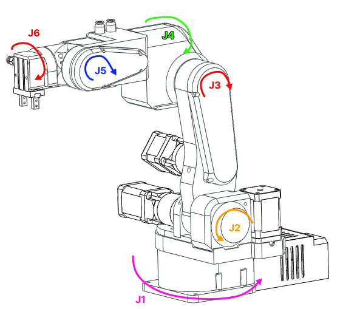  

                        Figure 1: Robot joint naming

### Rules and convenctions

#### Right hand rule for axes

The right-hand rule is a convention used to define the orientation of coordinate systems in three-dimensional space. It provides a consistent way to determine the positive directions of the axes (x, y, and z) in relation to each other.

Here's how the right-hand rule works when assigning coordinate systems:

* Thumb: Align your right thumb along the positive direction of the first axis (usually the x-axis). This is the axis that typically points to the right.

* Index Finger: Extend your right index finger perpendicular to your thumb. This represents the positive direction of the second axis (usually the y-axis), which is often considered the "up" direction.

* Middle Finger: Orient your right middle finger so that it is also perpendicular to your thumb and index finger. The middle finger represents the positive direction of the third axis (usually the z-axis), forming a right-handed coordinate system.

With your hand in this configuration, the three fingers (thumb, index finger, and middle finger) define the positive directions of the x, y, and z axes, respectively. This right-hand rule establishes a consistent standard for defining coordinate systems in three-dimensional space.

For rotation; orient your thumb in positive direction of axes you want to see positive rotation for. Your fingers now curl in the positive direction of rotation around that axis.

## Concepts

### Types of robots and number of joints

There are a lot of robot types in industry. They are usually categorised by number of joints and how they are arranged. Some of the types of the robots are:

    • Vertically articulated.
    • Cartesian.
    • Cylindrical.
    • Polar.
    • Selective compliance assembly robot arm (SCARA).
    • Delta

PAROL6 is vartically articulated robot. All conecpts here apply to any type of the robot but most of the examples will be for robots like PAROL6.

### Spherical wrist

The first 3 axes are used to position the end effector in cartesian space while the last 3 joints are used to change the end effector orientation.  PAROL6 uses a popular configuration where the axes of rotation of the last 3 joints intersect. That configuration is called a spherical wrist and is one of the most common configurations you will see in industrial robots.  A spherical wrist allows for much easier and faster calculation of inverse kinematics.  You can see an example of a spherical wrist on the example of Faze4 robotic arm in the image below.

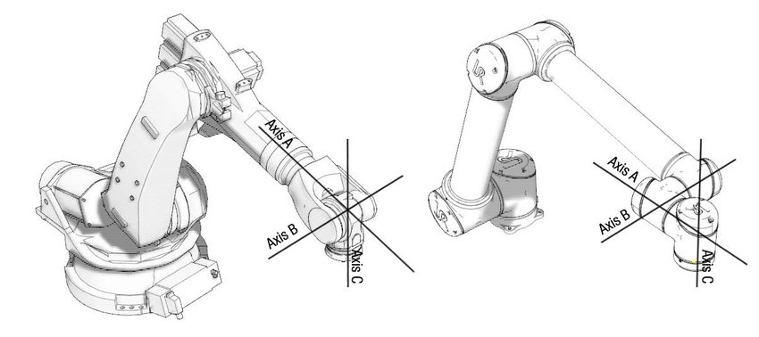  

    	                Figure 2: left robot with spherical wrist, right robot without spherical wrist

### Orientation 

6 axes means it has 6 joints in our case 6 rotational joints. Joints are connected with links. 
The advantage of robot arms of this type is that they can get to the same position in space with different orientations.  Both pictures show the arm at position x=0.3m, y=0.3m, and z=0.2m but as you can see orientations are different. Robot's pose in 3D space is described by the position and orientation ( rotation) of the robot's end effector in 3D space.

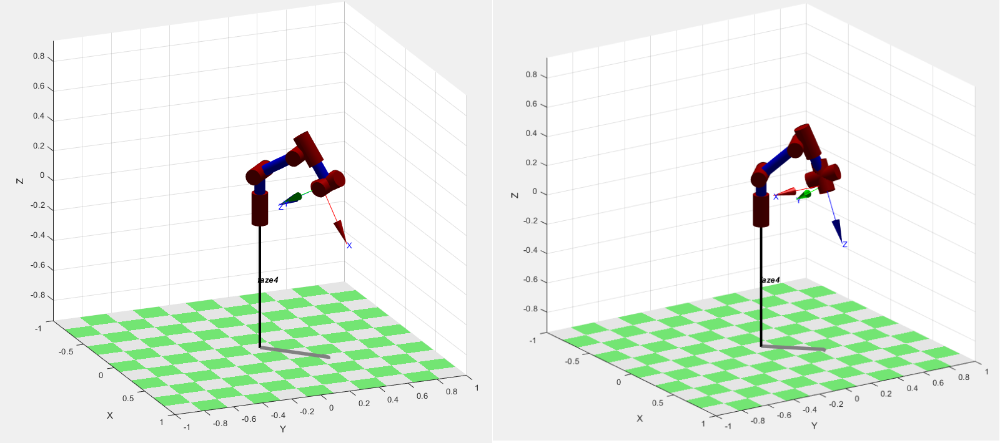  

                        Figure 3: Same position in space different orientation

### Frames

Coordinate frames or axes are often included at each joint to show the orientation and position of each joint relative to a common reference frame. These frames help in defining the transformations between different segments of the arm.

#### WRF 

World reference frame
This is a static frame that is fixed in real world. It is usually located in the base of the robot. 
For PAROL6 it is located in the base. See figure xx. Coordinate frame represents world frame.

#### TRF

TRF - Tool reference frame
Reference frame that is associated to robots end-effector. This frame changes depending on what end effector you use. 

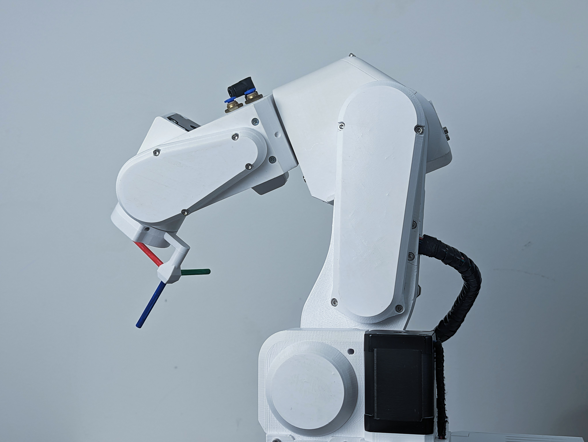  

                        Figure 4: Robot with TRF 

### Links

The links represent the rigid segments or sections of the robotic arm. These could be actual physical components or conceptual representations. Links are typically depicted as straight lines connecting joints.
Links can for example be shoulder, wrist, forearm...

### Joints

The joints represent the articulation points where motion occurs. These can include revolute joints (rotational) and prismatic joints (linear). Joints are often shown as small circles or symbols, with appropriate labels indicating the type of joint and possibly its degree of freedom.

#### Joint limits

### Kinematic diagram

A kinematic diagram of a robotic arm is a simplified graphical representation that illustrates the arrangement of links and joints in the robotic arm. It serves to convey the essential geometric and kinematic relationships between the various components of the arm without necessarily capturing all the physical details.

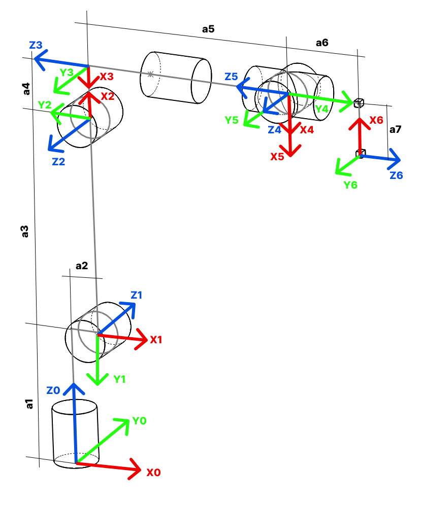  

### Denavit-Hartenberg parameters

Denavit-Hartenberg parameters are a set of standardized parameters used to describe the geometry and kinematics of robotic arms and mechanisms. They provide a systematic way to represent the transformation between consecutive coordinate frames along a robot's kinematic chain. These parameters were introduced by Jacques Denavit and Richard S. Hartenberg in the 1950s and have become a fundamental tool in robotics.

The Denavit-Hartenberg parameters consist of four values associated with each joint of a robotic arm:

* Link Length (a): The distance between the common normal (perpendicular) to the current and next joint axes, measured along the previous joint axis.
* Link Twist (α): The angle between the common normal of the current and next joint axes, measured along the previous joint axis.
* Link Offset (d): The distance between the joint axes along the common normal, measured along the current joint axis.
* Joint Angle (θ): The angle of rotation or translation about the current joint axis to align the coordinate frames.

These parameters are defined for each pair of consecutive joints in the robot's kinematic chain. By applying a sequence of transformations using these parameters, you can calculate the overall transformation matrix that represents the position and orientation of each link relative to a reference frame.

The Denavit-Hartenberg parameters provide a consistent and concise way to model and analyze the kinematics of complex robotic systems, making them a widely used approach in robot design, control, and simulation.

  

Great resources on how to build your robot using DH parameters:

 * Link
 * Link
 * Link

### Forward kinematics

Forward kinematics is a fundamental concept in robotics that involves determining the position and orientation of a robot's end effector (such as a gripper or tool) based on the known joint angles and link parameters. In simpler terms, it's the process of calculating the robot's pose (position and orientation) in space given the joint configurations.

The forward kinematics problem is about understanding how the robot's various joints and links combine to determine the position and orientation of the end effector. It's like tracing the path of the robot's movements to find out where its hand or tool ends up.

### Inverse kinematics

Inverse kinematics is a fundamental concept in robotics that involves determining the joint angles or parameters of a robotic mechanism in order to achieve a desired end-effector position and orientation. In simpler terms, it's the process of calculating the joint configurations that will result in a specific pose (position and orientation) of the robot's end-effector (e.g., its hand or tool).

In a robotic arm, for example, the forward kinematics process involves calculating the position and orientation of the end-effector based on the given joint angles. Inverse kinematics, on the other hand, works the opposite way: given a desired position and orientation for the end-effector, it calculates the joint angles that will achieve that particular pose.

Inverse kinematics can be quite complex, especially for robots with multiple joints and degrees of freedom. Solving inverse kinematics involves finding solutions to sets of nonlinear equations that relate the joint variables to the desired end-effector pose. Depending on the robot's geometry and the specific task at hand, there may be multiple solutions, a unique solution, or even no solution.

Inverse kinematics is crucial for tasks such as trajectory planning, motion control, and object manipulation, as it allows the robot to determine how to move its joints to achieve a specific goal in its operational environment. It's used in applications ranging from industrial robotics and automation to animation and simulation.

### Task planning
### Path planning
### Resolved rate motion
### Trahjectory planning
### Trajectory following
### Joint space

### Cartesian space

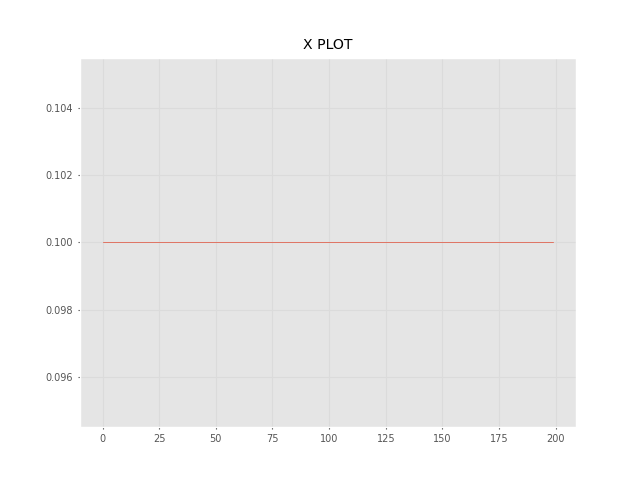  

  

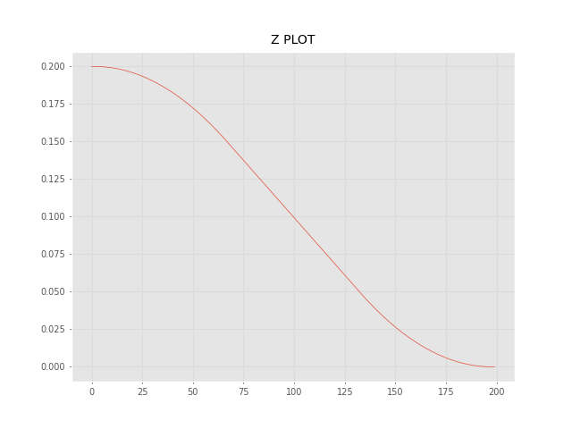  

  

### Jacobian
### 3D representation
### Singularity
### Workspace
### Reach
### Velocity control
### Position control
### Torque control
### Blends
### Trajectory

#### Trapezoidal velocity profile 

  

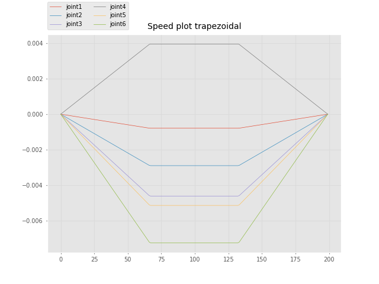  

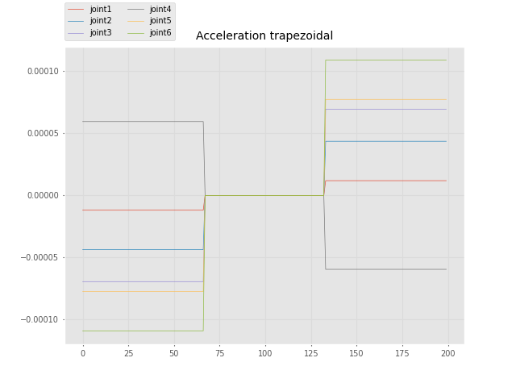  

#### Polynomial velocity profile

A quintic (5th order) polynomial is used with default zero boundary conditions for velocity and acceleration. 
Zero boundary conditions mean that  typically means that you assume 
that the velocity and acceleration are zero at the endpoints of the interval being interpolated. 
This assumption is often used when constructing interpolating polynomials for motion or 
physical systems where you want to ensure that the motion starts and ends from rest (zero velocity and acceleration).

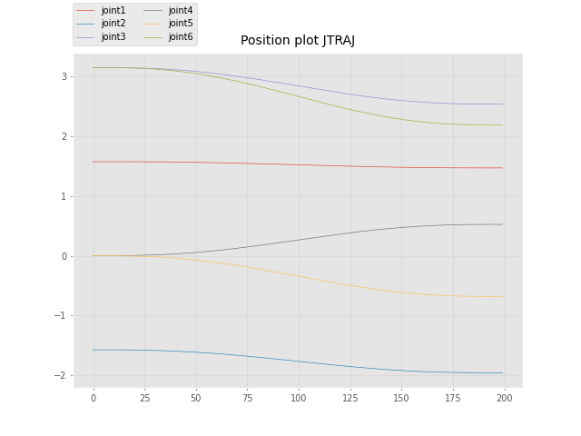  

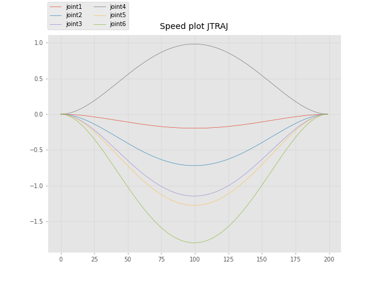  

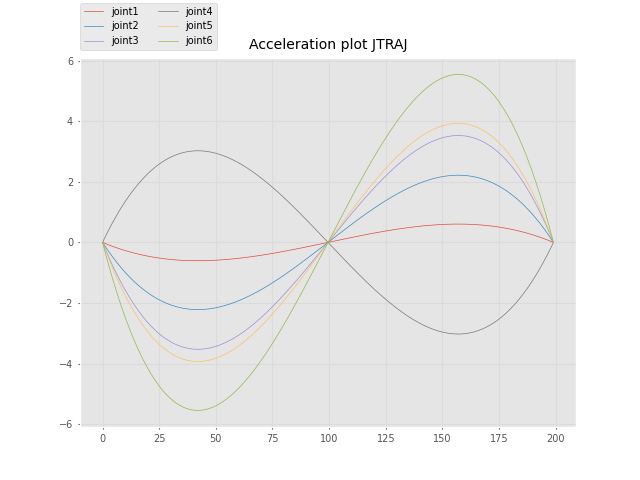  

### Mastering the robot
### Robot mastering
### zero position mastering
### Witness marks
### Backlash
### Actuators
### Machine learning
### Communication protocols
### Robot loop times
### Open loop control
### Closed loop control
### Stepper motors
### Encoders
### PID loops
### Homing
### ROS 
### Matlab

