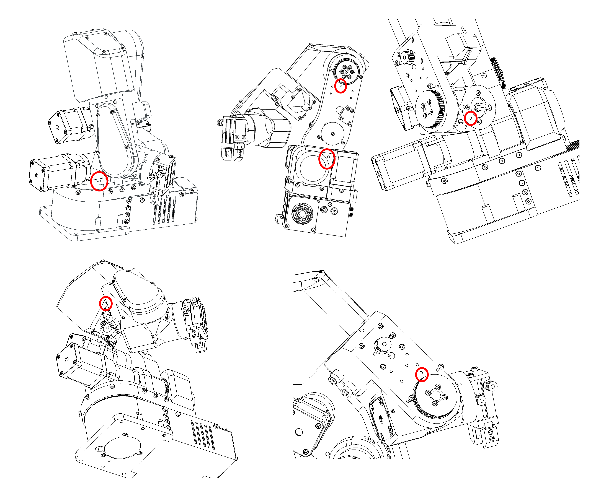

# General concepts

The PAROL6 robotic arm serves as an exceptional tool for educators aiming to enhance their students' understanding of robotics and automation. Its innovative design and user-friendly features make it an ideal platform for various educational settings. In our commitment to fostering a deep understanding of robotics and empowering educators to enhance their curriculums, the PAROL6 documentation includes a dedicated "Theory Corner." This section serves as a valuable resource for individuals seeking to delve into the theoretical foundations of robotics and educators striving to enrich their teaching materials.

The Theory Corner is designed to provide comprehensive explanations of essential robotic concepts. Whether you're a newcomer to robotics or a seasoned enthusiast, this section offers insights into topics such as kinematics, dynamics, control systems, sensors, programming languages, and more. 

!!! Note annotate "Note"

    This is still work in progress and is being constantly updated!  

## Want to know more? 

Here is a list of great resources that you can use to learn more about robotics:

* [https://robotacademy.net.au/](https://robotacademy.net.au/)
* [https://automaticaddison.com/](https://automaticaddison.com/)
* [https://robogrok.com/](https://robogrok.com/)
* [https://github.com/mithi/robotics-coursework](https://github.com/mithi/robotics-coursework)
* [https://robotics-explained.com](https://robotics-explained.com/)

## Basic theory

### Joints and naming

Joint are numbered from bottom to the top of the arm. In case of PAROL6 it follows naming on the Figure 1.

  

                        Figure: Robot joint naming

### Rules and convenctions

#### Right hand rule for axes

The right-hand rule is a convention used to define the orientation of coordinate systems in three-dimensional space. It provides a consistent way to determine the positive directions of the axes (x, y, and z) in relation to each other.

Here's how the right-hand rule works when assigning coordinate systems:

* Thumb: Align your right thumb along the positive direction of the first axis (usually the x-axis). This is the axis that typically points to the right.

* Index Finger: Extend your right index finger perpendicular to your thumb. This represents the positive direction of the second axis (usually the y-axis), which is often considered the "up" direction.

* Middle Finger: Orient your right middle finger so that it is also perpendicular to your thumb and index finger. The middle finger represents the positive direction of the third axis (usually the z-axis), forming a right-handed coordinate system.

With your hand in this configuration, the three fingers (thumb, index finger, and middle finger) define the positive directions of the x, y, and z axes, respectively. This right-hand rule establishes a consistent standard for defining coordinate systems in three-dimensional space.

For rotation; orient your thumb in positive direction of axes you want to see positive rotation for. Your fingers now curl in the positive direction of rotation around that axis.

## Concepts

### Types of robots and number of joints

There are a lot of robot types in industry usually categorised by number of joints and how the joints are arranged. Some of the types of the robots are:

    • Vertically articulated.
    • Cartesian.
    • Cylindrical.
    • Polar.
    • Selective compliance assembly robot arm (SCARA).
    • Delta

PAROL6 is vertically articulated robot. All conecepts here apply to any type of the robot but most of the examples will be for robots like PAROL6.

### Spherical wrist

The first 3 axes are used to position the end effector in cartesian space while the last 3 joints are used to change the end effector orientation.  PAROL6 uses a popular configuration where the axes of rotation of the last 3 joints intersect. That configuration is called a spherical wrist and is one of the most common configurations you will see in industrial robots.  A spherical wrist allows for much easier and faster calculation of inverse kinematics.  You can see an example of a spherical wrist on the example of Faze4 robotic arm in the image below.

  

    	                Figure: left robot with spherical wrist, right robot without spherical wrist

### Robot pose

In robotics, the term "pose" refers to the position and orientation of a robot in its environment. It provides a complete description of where the robot is located and how it is oriented relative to a specific coordinate system or frame of reference. The pose typically includes:

 *  Position: This specifies the location of the robot in the environment. In a 2D space, this is often represented by a pair of coordinates (x, y), while in a 3D space, it includes three coordinates (x, y, z). These coordinates are usually given with respect to a fixed reference point.

* Orientation: This specifies the orientation or rotation of the robot in space. In 2D, it can be represented as an angle (θ) relative to a reference direction (e.g., the x-axis). In 3D, it often uses representations like Euler angles, roll-pitch-yaw angles, or rotation matrices to describe the orientation.

The combination of position and orientation fully defines the pose of the robot at a specific moment in time.

#### Orientation 

6 axes means it has 6 joints in our case 6 rotational joints. Joints are connected with links. 
The advantage of robot arms of this type is that they can get to the same position in space with different orientations.  Both pictures show the arm at position x=0.3m, y=0.3m, and z=0.2m but as you can see orientations are different. Robot's pose in 3D space is described by the position and orientation ( rotation) of the robot's end effector in 3D space.

  

                        Figure: Same position in space different orientation

### Positon

### Frames

Coordinate frames or axes are often included at each joint to show the orientation and position of each joint relative to a common reference frame. These frames help in defining the transformations between different segments of the arm.

#### WRF 

World reference frame
This is a static frame that is fixed in real world. It is usually located in the base of the robot. 
For PAROL6 it is located in the base. See figure xx. Coordinate frame represents world frame.

#### TRF

TRF - Tool reference frame
Reference frame that is associated to robots end-effector. This frame changes depending on what end effector you use. 

  

                        Figure: Robot with TRF 

### Links

The links represent the rigid segments or sections of the robotic arm. These could be actual physical components or conceptual representations. Links are typically depicted as straight lines connecting joints.
Links can for example be shoulder, wrist, forearm...

### Joints

The joints represent the articulation points where motion occurs. These can include revolute joints (rotational) and prismatic joints (linear). Joints are often shown as small circles or symbols, with appropriate labels indicating the type of joint and possibly its degree of freedom.

#### Joint limits

### Kinematic diagram

A kinematic diagram of a robotic arm is a simplified graphical representation that illustrates the arrangement of links and joints in the robotic arm. It serves to convey the essential geometric and kinematic relationships between the various components of the arm without necessarily capturing all the physical details.

  

### Denavit-Hartenberg parameters

Denavit-Hartenberg parameters are a set of standardized parameters used to describe the geometry and kinematics of robotic arms and mechanisms. They provide a systematic way to represent the transformation between consecutive coordinate frames along a robot's kinematic chain. These parameters were introduced by Jacques Denavit and Richard S. Hartenberg in the 1950s and have become a fundamental tool in robotics.

The Denavit-Hartenberg parameters consist of four values associated with each joint of a robotic arm:

* Link length = distance Zi-1 from Oi-1 to the intersection with Xi.
* Link offset = Distance from Oi-1 and Oi measured along Xi
* θ THETA = Rotation around Zi-1 to get Xi-1 to match Xi
* α ALPHA = Rotation around Xi to get Zi-1 to match Zi (We are rotating frame Oi-1 around Xi)

These parameters are defined for each pair of consecutive joints in the robot's kinematic chain. By applying a sequence of transformations using these parameters, you can calculate the overall transformation matrix that represents the position and orientation of each link relative to a reference frame.

The Denavit-Hartenberg parameters provide a consistent and concise way to model and analyze the kinematics of complex robotic systems, making them a widely used approach in robot design, control, and simulation.

Great guides:

* [Link](https://automaticaddison.com/how-to-assign-denavit-hartenberg-frames-to-robotic-arms/)
* [Link](https://automaticaddison.com/how-to-find-denavit-hartenberg-parameter-tables/)

  

Great resources on how to build your robot using DH parameters:

 * Link
 * Link
 * Link

### Forward kinematics

Forward kinematics is a fundamental concept in robotics that involves determining the position and orientation of a robot's end effector (such as a gripper or tool) based on the known joint angles and link parameters. In simpler terms, it's the process of calculating the robot's pose (position and orientation) in space given the joint configurations.

The forward kinematics problem is about understanding how the robot's various joints and links combine to determine the position and orientation of the end effector. It's like tracing the path of the robot's movements to find out where its hand or tool ends up.

### Inverse kinematics

Inverse kinematics is a fundamental concept in robotics that involves determining the joint angles or parameters of a robotic mechanism in order to achieve a desired end-effector position and orientation. In simpler terms, it's the process of calculating the joint configurations that will result in a specific pose (position and orientation) of the robot's end-effector (e.g., its hand or tool).

In a robotic arm, for example, the forward kinematics process involves calculating the position and orientation of the end-effector based on the given joint angles. Inverse kinematics, on the other hand, works the opposite way: given a desired position and orientation for the end-effector, it calculates the joint angles that will achieve that particular pose.

Inverse kinematics can be quite complex, especially for robots with multiple joints and degrees of freedom. Solving inverse kinematics involves finding solutions to sets of nonlinear equations that relate the joint variables to the desired end-effector pose. Depending on the robot's geometry and the specific task at hand, there may be multiple solutions, a unique solution, or even no solution.

Inverse kinematics is crucial for tasks such as trajectory planning, motion control, and object manipulation, as it allows the robot to determine how to move its joints to achieve a specific goal in its operational environment. It's used in applications ranging from industrial robotics and automation to animation and simulation.

### Task planning
### Path planning
### Resolved rate motion
### Trahjectory planning
### Trajectory following
### Joint space

### Cartesian space

  

### Jacobian
### 3D representation
### Singularity

When a robot navigates through Cartesian space, the reference frame transitions from individual joints to the end effector. The robot employs various joint movements to achieve the desired Cartesian motion for the end effector. To optimize joint movements, the robot calculates the necessary displacement and direction for each joint. This method generally works efficiently for most arm configurations. However, challenges arise at singularities, which occur when joints reach their limits or when two or more joints align collinearly.

At these joint alignments, certain movements within Cartesian space become unattainable, leading to exceedingly high joint velocities. The mathematical equations governing the robot's motion approach singularity when divided by  small values. The actual singularity manifests when one of these equations is divided by zero, signifying the impossibility of the movement.

Singularity point represent critical zones where the robot's kinematic equations encounter mathematical limitations due to specific joint configurations, resulting in movement impossibilities or erratic behavior.

 [Video demonstration of singularities](https://www.youtube.com/watch?v=BJnZvwAE0PY&list=LL&index=1&ab_channel=industrial_robotics)

If you plan to program the robot to perform some tasks you will inevitably have to deal with singularities. These unique configurations can significantly obstruct the Cartesian movements of your robot's end-effector. It's important to understand how to navigate around robot singularities by strategically designing your robot cell.

Because singularities are common in 6 axes robotic arms, you must learn how to identify and avoid them. 

Now that you know what are singularities and how to recognise them, how do we avoid them? This is a hard problem and usually requires a lot of trial and error. It can be only avoided by properly designing your robotic cell or task. If your robot is mounted to the cell and it keeps hitting the singularities you can do few things:
* Change the adapter plate of your gripper/end-effector to be at a different angle.
* Relocate the robot around the robotic cell
* try another robot configuration/pose

Certain robot manufacturers provide singularity avoidance features allowing the robot's end-effector to make slight deviations from the intended Cartesian trajectory to circumvent singularities. These options prove highly beneficial when absolute adherence to the trajectory isn't crucial. For instance, in scenarios where the robot's task involves movement away from or towards a target rather than precision tasks like gluing or assembly.

These deviations enable seamless and smoother end-effector motion, ensuring continuity in movement without interruptions caused by singularities. By allowing slight deviations, the robot can navigate around singularities, maintaining a more stable and continuous trajectory while performing tasks that do not demand pinpoint accuracy.

In contrast, PAROL6 robotic arm will try to keep the desired Cartesian trajectory although that might mean that the end-effector will stop when near singularity. Feature to try to avoid the singularity by small deviations is not implemented.

### Workspace
### Reach
### Velocity control
### Position control
### Torque control
### Blends
### Trajectory

### Optimal path placement

Optimal path placement leads to faster cycle times and larger paths
optimal choice of configuration leaed to larger workspace
design cell layout correctly
a lot of trial and error.

#### Trapezoidal velocity profile 

  

#### Polynomial velocity profile

A quintic (5th order) polynomial is used with default zero boundary conditions for velocity and acceleration. 
Zero boundary conditions mean that  typically means that you assume 
that the velocity and acceleration are zero at the endpoints of the interval being interpolated. 
This assumption is often used when constructing interpolating polynomials for motion or 
physical systems where you want to ensure that the motion starts and ends from rest (zero velocity and acceleration).

  

### Witness marks

 In the context of robot arms, "witness marks" typically refer to marks or indicators that are used to verify or witness the alignment, position, or movement of components or parts within the robotic system. These marks can serve various purposes in robot arms and automation; but are usually used to master the robot.

Witness marks can be used during the calibration process to ensure that different components are properly aligned or positioned as per the specified configuration.

Parol6, Faze4, and CM6 robotic arms also have witness marks. These marks are indicated by holes in the mechanical parts, allowing the parts to be aligned by inserting a pin through those holes.

  

                        Figure: Witness marks of PAROL6 robot 

### Robot mastering

Mastering the robotic arm is the process of bringing your robots joints to the witness mark of that joint and recording the position that robot is at that point.

When at the position of the witness mark robots position is know because of our knowledge of robots kinematics and CAD. it basically assigns robots encoder ticks / stepper ticks to the know joint angle

Lets take an example of J1 of our PAROL6 robotic arm

  

                        Figure: Standby position of PAROL6 robotic arm

At this exact position our robots joint is at 0 degrees. If everything was perfect you would place a pin at the witness marks and it would fit with no problems. 

### Homing

Homing is a process where a robot joint finds a known position in its rotation space, typically by hitting a limit switch or sensor.

The process for PAROL6 and FAZE4 robots is the same as that for 3D printers. After powering up, the robot doesn't know its position and needs to be homed. By hitting a limit switch, we determine the robot joint's position based on our knowledge of the limit switch's location, which we have from the CAD model. For example, when we hit a limit switch on Joint 1, we know that we need xxx steps to reach a witness mark or Joint 1's 0-degree position.

Now that we know our position after homing and the number of steps required from the limit switch to the witness mark, you might think we're done, right? Well, not quite. To be really precise, after hitting the limit switch, you should observe how many steps it actually takes from the limit switch to the witness mark. Each PAROL6 build may have slight differences due to various printers, tolerance variations, and parts.

The Parol6 control board comes preloaded with generic parameters that will work for anyone building the robot. However, if you want to fine-tune your robot, you now have the option to do so.

    By default PAROL6 homes in these steps:
    * Joint 1,2 and 3 move to the limit switch at the same time
    * Once all are pressed they move away from them and press again.
    * Now joints 1,2 and 3 move to standby position
    * Now joint 4 homes
    * After joint 4 is homed it moves to its standby position
    * Now Joint6 homes
    * After it homes it goes to positon to home joint 5
    * After joint5 homes joints 5 and 6 move to the standby position

Homing needs to look like shown in this [video!](https://www.youtube.com/watch?v=OCCQkIWPWwo&ab_channel=Sourcerobotics)

### Backlash
### Actuators
### Machine learning
### Communication protocols
### Robot loop times
### Open loop control
### Closed loop control
### Stepper motors
### Encoders
### PID loops
### ROS 
### Matlab
### Test

