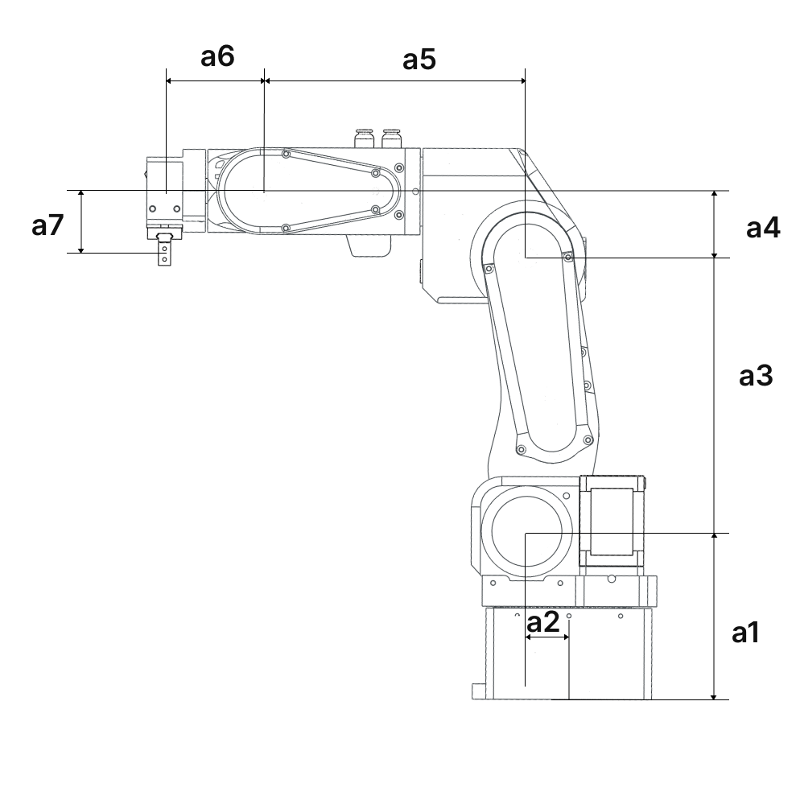
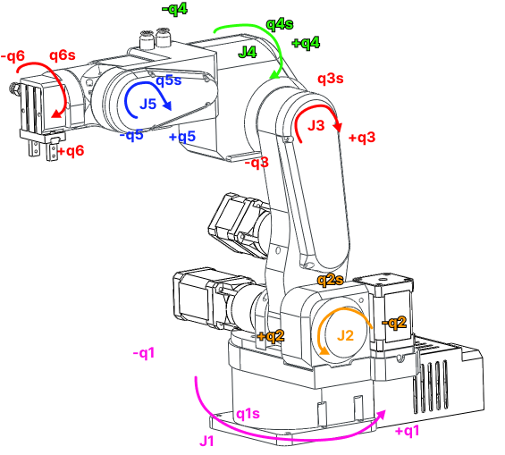

 
# Robot specifications

## Specs 

* Payload: 1 Kg
* Weight: 5.5 Kg
* Reach: 400 mm with the standard gripper
* Degrees of freedom: 6 rotating joints
* Material: 3D printed PETG plastic
* Power consumption: 40W
* Repeatability: 0.08 mm
* Precision: 
* Rotation range: 
- 1 – 250 deg
- 2 – 141 deg
- 3 – 180 deg
- 4 – 212 deg
- 5 – 180 deg
- 6 - ∞
* Motors: Steppers
* Gearboxes: precision planetary and bets
* Position sensing: Limit switches for open loop version, magnetic encoders for closed-loop version
* Drivers: Open-loop stepper drivers for open loop version, magnetic encoders for closed-loop version
* Number of isolated inputs: 2
* Number of isolated outputs: 2
* Number of CAN buses: 2
* Communication with master PC: USB 
* Pneumatic connectors: 2

## Dimensions

  

|      |         |
| ----------- | ------------------------------------ |
| a1       | :material-check:     Fetch resource  | 
| a2      | :material-check-all: Update resource | 
| a3    | :material-close:     Delete resource |
| a4       | :material-check:     Fetch resource  | 
| a5       | :material-check-all: Update resource | 
| a6    | :material-close:     Delete resource |

## Joint limits

  

| Joint      | Limit in negative direction        | Standby position| Limit in positive direction |
| ----------- | ------------------------------------ | -- | ------------------------------------ |
| J1       | :material-check:     Fetch resource  | -- | ---- |
| J2       | :material-check-all: Update resource | -- | ---- |
| J3    | :material-close:     Delete resource | -- | ---- |
| J4       | :material-check:     Fetch resource  | -- | ---- |
| J5       | :material-check-all: Update resource | -- | ---- |
| J6    | :material-close:     Delete resource | -- | ---- |