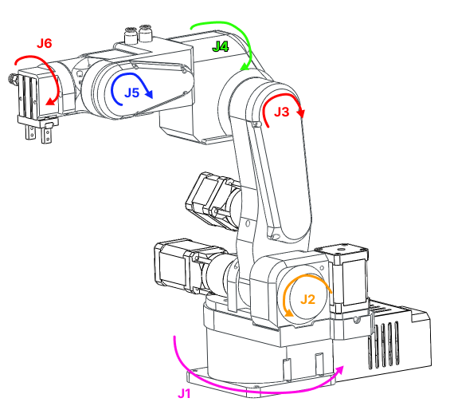

 
# Robot specifications

## Specs 

* Payload: 1 Kg
* Weight: 5.5 Kg
* Reach: 400 mm with the standard gripper
* Degrees of freedom: 6 rotating joints
* Material: 3D printed PETG plastic
* Power consumption: 40W
* Repeatability: 0.1 mm
* Precision: 
* Rotation range: 
- 1 – 250 deg
- 2 – 141 deg
- 3 – 180 deg
- 4 – 212 deg
- 5 – 180 deg
- 6 - ∞
* Motors: Steppers
* Gearboxes: precision planetary and bets
* Position sensing: Limit switches for open loop version
* Drivers: Open-loop stepper drivers for open loop version
* Number of isolated outputs: 2
* Number of CAN buses: 2
* Communication with master PC: USB 
* Pneumatic connectors: 2

## Operating temperatures

Stepper motors can work up to 100-110 degrees with no problems. In case of PAROL6 that is not acceptable since it is built out of plastic. That is why we recommend PETG because of its high glass transiton temperature. 
Stepper motors will reach these temperatures after 5 hours when just holding position:

* Joint 1 - 51 °C
* Joint 2 - 54 °C
* Joint 3 - 48 °C
* Joint 4 - 60 °C
* Joint 5 - 60 °C
* Joint 6 - 61 °C

When robot is moving it will reach these temperatures after 2 hours:

* Joint 1 -  64 °C
* Joint 2 -  64 °C
* Joint 3 -  52 °C
* Joint 4 -  73 °C
* Joint 5 -  72 °C
* Joint 6 -  65 °C

Currents can be adjusted by adjusting values in PAROL6 control board. 
Values to be adjusted are located in constants.h  
MOTORx_MAX_CURRENT is max stepper current.  
In motor_init.cpp you can adjust: Joint__->hold_multiplier (Hold_current = MAX_current * hold_multiplier) 
Adjusting currents will reduce motor torque production and in turn max speeds/accels. 

!!! Danger

    **When using robot for longer periods you MUST REDUCE THE CURRENT in the software or you risk destroying your robot!** 

## Dimensions

  

Dimensions using default pneumatic gripper!

|      |         |
| ----------- | ------------------------------------ |
| a1       |  110.50 mm | 
| a2      | 23.42 mm | 
| a3    | 180.00 mm |
| a4       | 43.50 mm  | 
| a5       | 176.35 mm| 
| a6    | 62.8 mm|
| a7    | 45.25 mm|

!!! Note annotate "Dimensions can change!"

    For example when you change grippers or put robot on aditional base.  
    If that happens you need to change your parameters in DH table, otherwise you kinematic diagram will be wrong   

## Kinematic diagram 

!!! Note annotate "Dimensions can change!"

    For example when you change grippers or put robot on aditional base.  
    If that happens you need to change your parameters in DH table, otherwise you kinematic diagram will be wrong   

  

* Digram for the robot using standard pneumatic gripper

## Denavit-Hartenberg parameters

  

!!! Warning annotate "Standby position"

    **THIS IS THE POSITION OF THE ROBOT DEFINED BY THE DH TABLE BELOW!**  
    **This position is also called standby positon!**  
    **In this position joint angles are as follows:**  
    **Joint 1 -> 0 degress**   
    **Joint 2 -> -90 degress**   
    **Joint 3 -> 180 degrees**  
    **Joint 4 -> 0 degrees**  
    **Joint 5 -> 0 degrees**  
    **Joint 6 -> 180 degrees**  

  

## Joint reduction ratios and microstepping 

Reduction ratios for each joint are as follows:

* Joint 1 -> Belt reduction: 6.4 : 1
* Joint 2 -> Planetary gearbox: 20 : 1
* Joint 3 -> Planetary gaerbox: 20 : 1 x Belt reduction 38 : 42 = 18.0952381
* Joint 4 -> Belt reduction: 4 : 1
* Joint 5 -> Belt reduction: 4 : 1
* Joint 6 -> Planterary gearbox: 10 : 1

Robot uses stepper motors. Microstepping is on all motors equal to 32.  
With 32 microstepping regular 200 steps per revolution stepper motor needs 6400 steps for one revolution.

Smallest theoretical steps with 32 microstep at the joint levels are   
(these values are after the reduction ratios!):

* Joint 1 -> 0.00015339807878856412 RAD --> 0.0087890625 DEG
* Joint 2 -> 4.9087385212340514e-05 RAD --> 0.0028125 DEG 
* Joint 3 -> 5.4254478392586896e-05 RAD --> 0.0031085526315789477 DEG
* Joint 4 -> 0.0002454369260617026 RAD  --> 0.0140625 DEG
* Joint 5 -> 0.0002454369260617026 RAD  --> 0.0140625 DEG
* Joint 6 -> 9.817477042468103e-05 RAD  --> 0.005625 DEG

## Joint limits

!!! Note annotate "TIP"

    Joint limits can change depending on type of gripper or base!   
    When using the robot make sure you use proper joint limits for your aplicaiton!   

Robot joint positive rotations are in the directions shown on the image!

  

!!! Note annotate "TIP"

    Values are in degrees!

| Joint      | Limit in negative direction        | Standby position| Limit in positive direction |
| ----------- | ------------------------------------ | -- | ------------------------------------ |
| J1       | -123.046875 | 0 | 123.046875 |
| J2       | 145.0088 | -90 | -3.375 |
| J3    | 107.866     | 180 | 287.8675 |
| J4       | -105.46975 | 0 | 105.46975|
| J5       | -90 | 0 |90 |
| J6    | 0 | 180 | 360 |