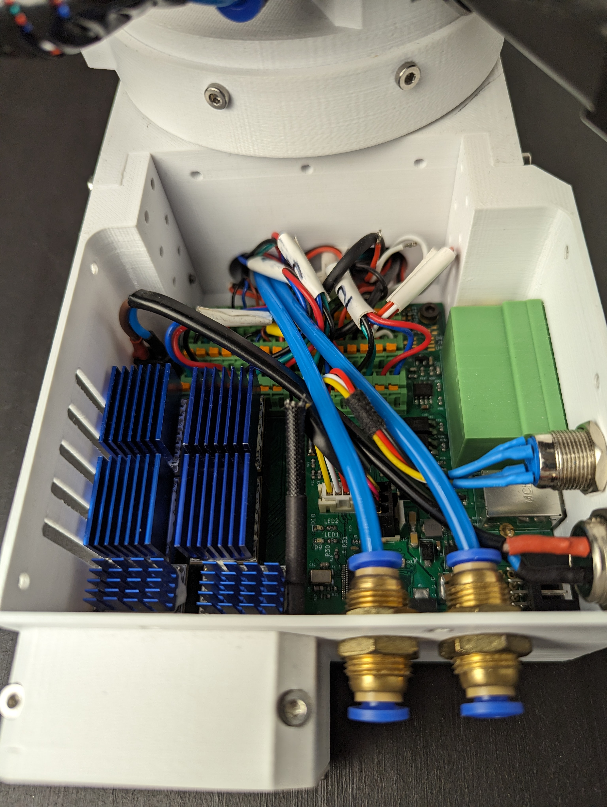

# PAROL6 control board

## Introduction

## Features
### Hardware specs
### Operating limits
### Expansions

## Physical properties
### Dimensions
### Mounting
### Cooling
### 3D models

## Physical connections

## Software

## PCB revision history
To use PAROL6 robotic arm you will need PAROL6 control board. PAROL6 control board is compact robotic controller. Its dimensions are 1x2x3 mm, that is little bigger then pack of playing cards. It allows PAROL6 to be really compact robot without the need of control cabinet that are usually the size of the whole robot. 

Some of the features of control board:

* Silent control of 6 stepper motors
* Ability to adjust current, microstepping and more thru SPI!
* Can connect up to 6 limit switches or sensors.
* 1 x USB port and 2 x CAN bus
* 2 isolated Inputs
* 2 isolated Outputs
* Flash memory for saving programs and running them without external PC
* Connector for Power button
* Connector for Cooling fan
* Dedicated port for ESTOP

  

## How to upload code

Microcontroller on PAROL6 control board is STM32F446RE. To upload code you need to use STlink device and connect it dedicated CLK, SWDIO, 3V3 and GND pins. You can use jumper cables or dedicated stlink + cable assembly.

## Wiring

  

Follow the image on top for wiring your PAROL6 robot to the control board. To connect wires to phoenix contacts we recommend using small tweezers. 

After sucesssful wiring of the robot it should look something like this. 

  

## Stepper drivers orientation

!!! Danger annotate "DANGER"

    **Failing to follow this WILL result in destruction of your PAROL6 control board**  
    

## Schematic