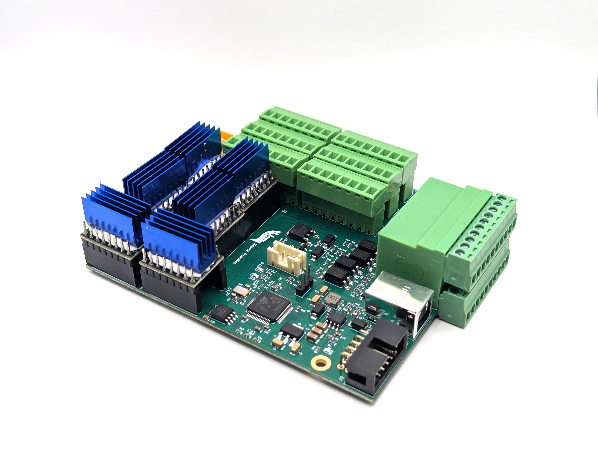
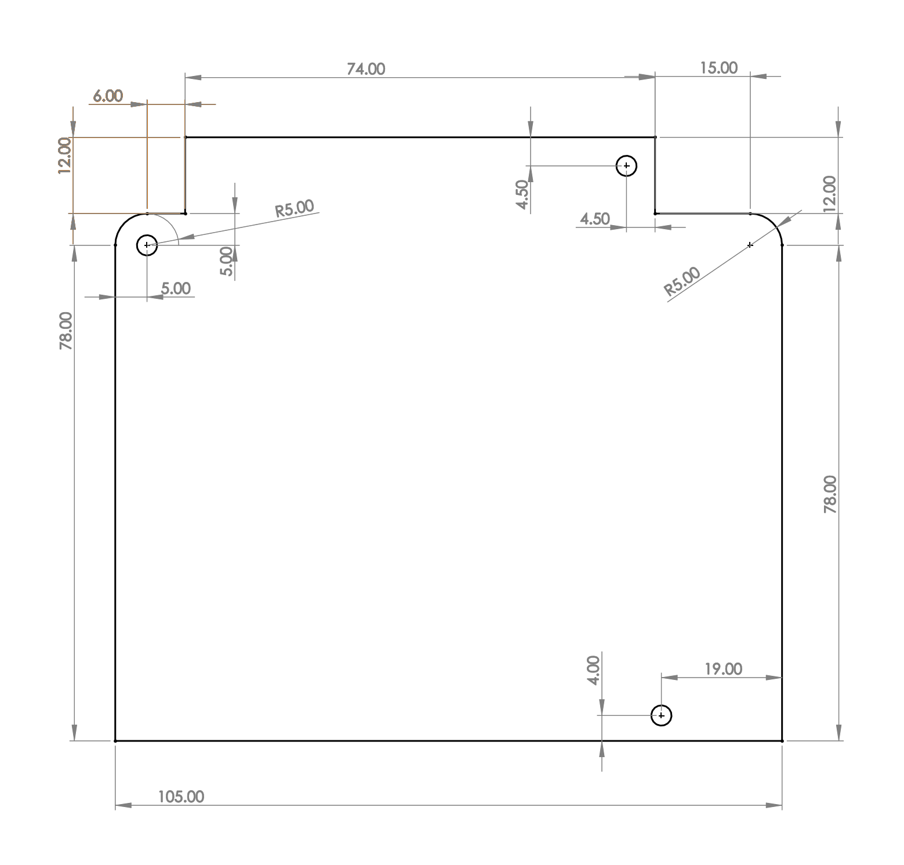
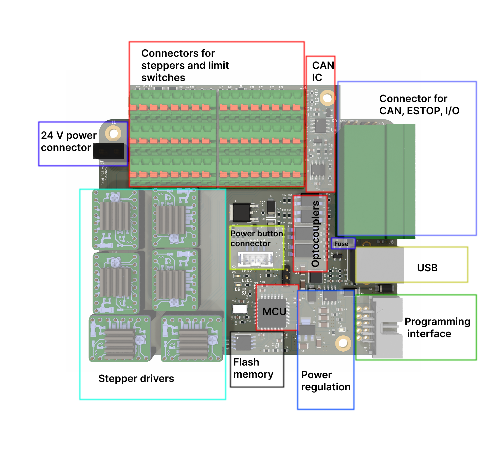
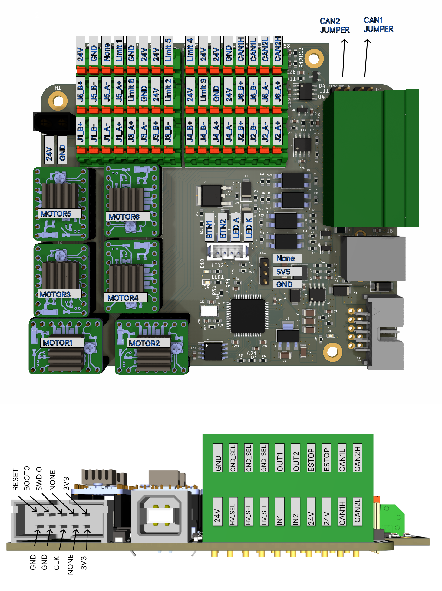
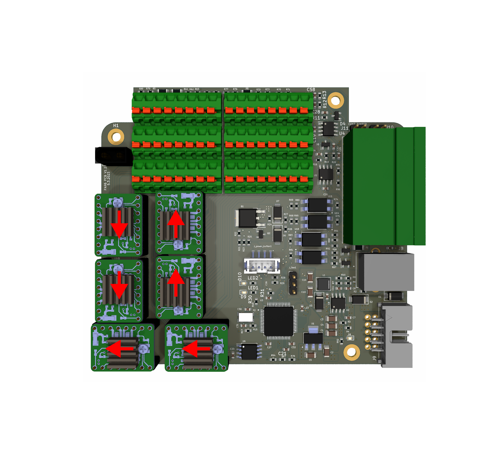
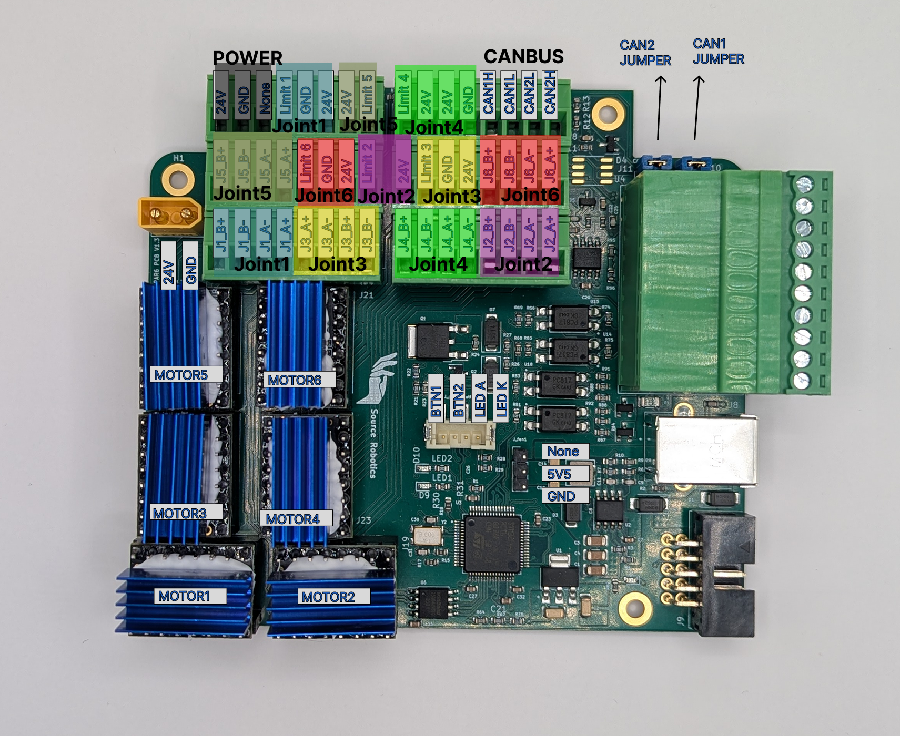
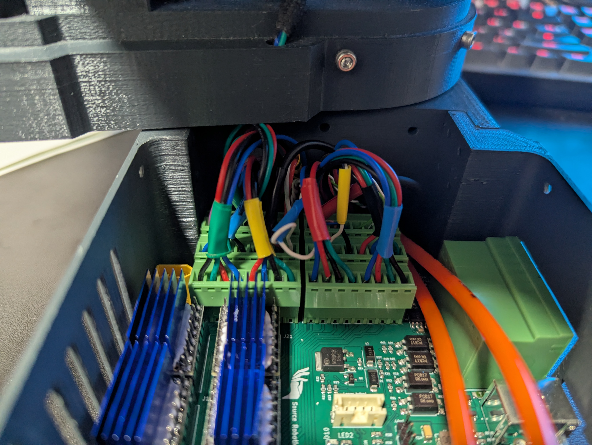
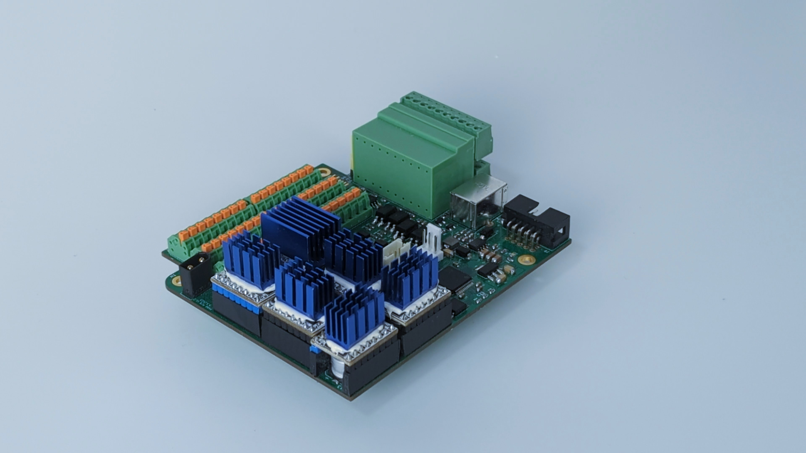

# **PAROL6 control board**

---

  

---

## **Introduction**

The PAROL6 control board is the advanced 32-bit controller for 6 AXES robotic arms like PAROL6. It works out of the box with PAROL6 and PAROL6 commander software.

To use PAROL6 robotic arm with PAROL6 commander software you will need a PAROL6 control board. The PAROL6 control board is a compact robotic controller. It is by size a little bigger than a pack of playing cards. It allows PAROL6 to be a really small and portable robot without the need for a control cabinet that is usually the size of the whole robot.

!!! note

    **There are two functionally identical versions of the PAROL6 control board. The version with orange spring-loaded contacts is no longer being produced. The version with a pluggable system terminal block is now in production and available in our store.** 

  

---

## **Features**

  

---

### **Hardware specs**

|      |         |
| ----------- | ------------------------------------ |
| Processor       |  STM32F446RE  | 
| Processor features      | Arm Cortex-M4 core with DSP and FPU, 512 Kbytes of Flash memory, 180 MHz CPU, ART Accelerator | 
| Communication interfaces    | 2 x CAN bus (CAN2 transceiver  is not soldered), 1 x USB   |
| Stepper drivers       | TMC5160   | 
| Stepper drivers features       | SPI comms, 10-35V, 3A max, protection features| 
| Inputs    |2 x ISOLATED|
| Ouputs    |   2 x ISOLATED, 0.5A current output|
| Estop input    |  Dedicated pin on MCU for ESTOP interrupt, 2 ESTOP connections on control board|
| Additional  memory    |  W25Q64FV, SPI, 64Mb|
| Programming  interface | JTAG |
| Cooling fan connection  | 5V cooling fan|
| Connection for smart power button   | |

---

### **Operating limits**

|      |         |
| ----------- | ------------------------------------ |
| Power supply       |  18V minimal, 24V maximal voltage | 
| Stepper drivers      | Rated current 2.5A, maximal current 3.6A (Short burst or extreme cooling) | 
| Temperature    | 100 deg stepper driver temperature warrning, 120 deg temperature error |
| Isolated Inputs voltage       | 24V nominal voltage, min 12V max 50V  | 
| Isolated Outputs voltage      | Max 48V| 
| Isolated Inputs current       |  | 
| Isolated Outputs current      | Max 1A| 
| Fuse    | Fuse is used for outputs if used in NON ISOLATED MOD; 2A fuse|
| Cooling fan   | Maximal allowed current draw for cooling fan is 0.3A |

---

## **Physical properties**

---

### **Dimensions**

!!! note

    **Dimensions are in millimeters!** 

  

---

### **Mounting**

3 Holes located on PAROL6 control board are used to mount the PCB. Use M3 screws!

---

### **Cooling**

Stepper drivers need cooling. It can be done with nocuta fan or any other 5V tolerant fan that fits the robot. In case of PAROL6 the fan needs to be of these dimensions: 40x40x20

Keep fan current draw around 0.1 A.
Do not go over 0.3 A.

!!! note

    **The fan cant be a PWM type fan!** 

---

## **Connections**

  

---

### **Connectors**

* 24 power connector on PAROL6 control board is XT30 MALE connector. 

* Connector for cooling fan on PAROL6 control is  3 pin 2.54 pitch 

* Connector for power on/off button on PAROL6 control is JST B4B-PH-SM4-TB(LF)(SN)

* Connector for USB on PAROL6 control is USB female type B

* Connector for programming adapter is 2 row x 5 pin 2.54 pitch 

---

### **Pin definitions**

!!! Note annotate "TIP"

    Even tho pins are named PUL1-PUL6 that does not mean they are  
    connected to that joint of the robot! Follow the connection plan below for  
    real connections!  

Connections:

        #define PUL1 PC6 ---> Controls Joint 1, PULS pin of stepper driver
        #define PUL2 PA10 --> Controls Joint 5, PULS pin of stepper driver
        #define PUL3 PC0 ---> Controls Joint 6, PULS pin of stepper driver
        #define PUL4 PC3 ---> Controls Joint 4, PULS pin of stepper driver
        #define PUL5 PC9 ---> Controls Joint 3, PULS pin of stepper driver
        #define PUL6 PC5 ---> Controls Joint 2, PULS pin of stepper driver

        #define DIR1 PB15 --> Controls Joint 1, DIR pin of stepper driver
        #define DIR2 PA1 ---> Controls Joint 5, DIR pin of stepper driver
        #define DIR3 PC1 ---> Controls Joint 6, DIR pin of stepper driver
        #define DIR4 PA0 ---> Controls Joint 4, DIR pin of stepper driver
        #define DIR5 PA8 ---> Controls Joint 3, DIR pin of stepper driver
        #define DIR6 PB1 ---> Controls Joint 2, DIR pin of stepper driver

        #define LIMIT1 PC12 ---> Connected to Limit 1 on PAROL6 control board
        #define LIMIT2 PB3  ---> Connected to Limit 2 on PAROL6 control board
        #define LIMIT3 PA15 ---> Connected to Limit 3 on PAROL6 control board
        #define LIMIT4 PD2  ---> Connected to Limit 4 on PAROL6 control board
        #define LIMIT5 PB4  ---> Connected to Limit 5 on PAROL6 control board
        #define LIMIT6 PC11 ---> Connected to Limit 6 on PAROL6 control board

        #define SELECT1 PC7  ---> Controls Joint 1, Select pin of stepper driver
        #define SELECT2 PA9  ---> Controls Joint 5, Select pin of stepper driver
        #define SELECT3 PC15 ---> Controls Joint 6, Select pin of stepper driver
        #define SELECT4 PC2  ---> Controls Joint 4, Select pin of stepper driver
        #define SELECT5 PC8  ---> Controls Joint 3, Select pin of stepper driver
        #define SELECT6 PC4  ---> Controls Joint 2, Select pin of stepper driver

        #define GLOBAL_ENABLE PA3  --> Connected to ENABLE pins of all stepper drivers.

        #define MISO PA6    --> SPI MISO; connected to all 6 stepper drivers and flash memory
        #define MOSI PA7    --> SPI MOSI; connected to all 6 stepper drivers and flash memory
        #define SCK PA5     --> SPI SCK; connected to all 6 stepper drivers and flash memory
        #define FLASH_SELECT PA4 --> Chip select pin of the flash memory

        #define LED1 PB2  --> LED1 on PCB
        #define LED2 PB10 --> LED2 on PCB

        #define SUPPLY_ON_OFF PC10 --> Connected to power button connector, turns on/off power fet
        #define SUPPLY_BUTTON_STATE PC14  --> Connected to power button connector, reads state of the button

        #define INPUT1 PB6      --> Connected to IN1 pins on the side of the board
        #define INPUT2 PB5      --> Connected to IN2 pins on the side of the board

        #define OUTPUT1 PC13    --> Connected to OUT2 pins on the side of the board
        #define OUTPUT2 PB7     --> Connected to OUT2 pins on the side of the board

        #define ESTOP PB14 --> Connected to ESTOP pins on the side of the board

        #define VBUS PB0   --> Reads voltage of the power supply voltage

        #define USB_D_PLUS  PA12 --> USB pins
        #define USB_D_MINUS PA11 --> USB pins

        #define CAN1TX PB9      --> CAN channel 1
        #define CAN1RX PB8      --> CAN channel 1

        #define CAN2TX PB13     --> CAN channel 2
        #define CAN2RX PB12     --> CAN channel 2

---

### **Stepper driver**

Please use stepper drivers that are listed in the BOM. In case you dont buy them from source robotics website you will need to do few modifications to them:

* Remove 2 diag pins 
* Apply thermal cement to attach the heatsink (Link to cement is in the BOM)

!!! Danger

    **ONLY USE STEP STICK THAT ARE SPECIFIED IN THE BOM!** 
    **Failing to do so will destroy your PAROL6 control board!** 

!!! Warrning

    **YOU NEED TO SECURE HEATSINK TO STEPPER DRIVER WITH TERMAL CEMENT!** 
    **Failing to do so will destroy your PAROL6 control board!** 

---    

### **Stepper driver orientation**

Stepper drivers need to be placed with respect to this diagram to the PAROL6 control board! 
Stepper drivers orientation can be recognised by 2 diagnostic pins!

!!! Warrning

    **Some stepper drivers have diag pins soldered. If they are soldered you NEED to remove them!** 
    **If diag pins are on the PCB they are blocked by the capacitors on PAROL6 PCB, and you cant place the modules in. ** 

  

!!! Info

    **If you find a fitting TMC5160 driver make sure that it follows the pinout from the image above. ** 

!!! Info

    **DIAG PINS SHOULD FOLLOW RED ARROWS ON THE IMAGE BELLOW!!** 

  

---

## **How to upload code**

Microcontroller on PAROL6 control board is STM32F446RE. To upload code you need to use STlink device and connect it dedicated CLK, SWDIO, 3V3 and GND pins. You can use jumper cables or [dedicated stlink + cable assembly](https://source-robotics.com/products/parol6-programming-adapter).

!!! Danger

    **Only use one of those 2 methods to program PAROL6 control board! Connecting STlink with a cable wihout adapter WILL KILL YOUR BOARD!** 

---

## **Wiring PAROL6 control board**

You need to follow this diagram to wire your PAROL6 robot arm to PAROL6 control board.

  

After sucesssful wiring of the robot and control board it should look somthing like this. 

Limit switches to 24V and signal. Inductive sensors to 24V, GND and signal.

  

  

---

## **Code upload**

If you are having problems with code upload via Stlink try installing the drivers:
https://www.st.com/en/development-tools/stsw-link009.html

---

## **PCB revision history**

Latest version of PAROL6 PCB is: V2.0

  

Version of PAROL6 PCB is: V1.2 that is no longer produced. This version used spring loaded phoenix contacts and is functionally the same as the latest version. 
 

  

