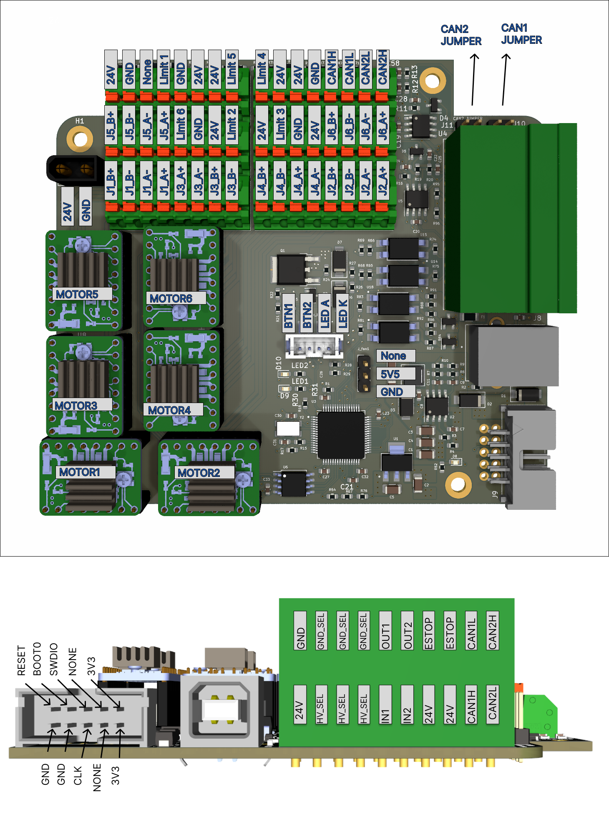

# PAROL6 control board

  

## Introduction

The PAROL6 control board is the advanced 32-bit controller for 6 AXES robotic arms like PAROL6. It works out of the box with PAROL6 and PAROL6 commander software.

To use PAROL6 robotic arm you will need a PAROL6 control board. The PAROL6 control board is a compact robotic controller. It is by size a little bigger than a pack of playing cards. It allows PAROL6 to be a really small and portable robot without the need for a control cabinet that is usually the size of the whole robot.

## Features

  

### Hardware specs

|      |         |
| ----------- | ------------------------------------ |
| Processor       |  110.50 mm | 
| Processor features      | 23.42 mm | 
| Communication interfaces    | 180.00 mm |
| Stepper drivers       | 43.50 mm  | 
| Stepper drivers features       | 176.35 mm| 
| Inputs    | 62.8 mm|
| Ouputs    | 45.25 mm|
| Estop input    | 62.8 mm|
| AdDitional memory    | 45.25 mm|
| Programming  interface | JTAG |
| Cooling fan connection  | 62.8 mm|
| Connection for smart power button   | 45.25 mm|

TMC5160
* Silent control of 6 stepper motors
* Ability to adjust current, microstepping and more thru SPI!
* Can connect up to 6 limit switches or sensors.
* 1 x USB port and 2 x CAN bus
* 2 isolated Inputs
* 2 isolated Outputs
* Flash memory for saving programs and running them without external PC
* Connector for Power button
* Connector for Cooling fan
* Dedicated port for ESTOP

### Operating limits

* Power supply
* Stepper drivers
* Temperature
* Inputs 
* Outputs
* Fuse
* Cooling fan

|      |         |
| ----------- | ------------------------------------ |
| Power supply       |  18V minimal, 24V maximal voltage | 
| Stepper drivers      | Rated current 2.5A, maximal current 3.6A (Short burst or extreme cooling) | 
| Temperature    | xx stepper driver temperature warrning, xx temperature error |
| Isolated Inputs voltage       | 24V nominal voltage, min 12V max 50V  | 
| Isolated Outputs voltage      | 176.35 mm| 
| Isolated Inputs current       | 24V nominal voltage, min 12V max 50V  | 
| Isolated Outputs current      | 176.35 mm| 
| Fuse    | Fuse is used for outputs if used in NON ISOLATED MOD; 2A fuse|
| Cooling fan   | Maximal allowed current draw for cooling fan is 0.3A |

## Physical properties

### Dimensions

!!! note

    ** Dimensions are in milimeters! ** 

  

### Mounting

3 Holes located on PAROL6 control board are used to mount the PCB. Use M3 screws!

### Cooling

Stepper drivers need cooling. It can be done with nocuta fan or any other 5V tolerant fan that fits the robot. In case of PAROL6 the fan needs to be of these dimensions: 40x40x20

Keep fan current draw around 0.1 A.
Do not go over 0.3 A.

### 3D models

## Connections

### Connectors

* 24 power connector on PAROL6 control board is XT30 MALE connector. 

* Connector for cooling fan on PAROL6 control is 

* Connector for power on/off button on PAROL6 control is 

* Connector for USB on PAROL6 control is USB female type B

### Schematic

!!! note

    ** View schematic in PDF view. Images are hard to read! ** 

Link to PDF schematic!

  

  

  

### Pin connections

  

### Pin definitions

### Stepper driver orientation

!!! Danger

    ** Only use step sticks that are verified in this document! ** 
    ** Failing to do so will destroy your PAROL6 control board! ** 

Stepper drivers need to be placed with respect to this diagram to the PAROL6 control board! 
Stepper drivers orientation can be recognised by 2 diagnostic pins!

  

## How to upload code

Microcontroller on PAROL6 control board is STM32F446RE. To upload code you need to use STlink device and connect it dedicated CLK, SWDIO, 3V3 and GND pins. You can use jumper cables or dedicated stlink + cable assembly.

## Getting connected

## Wiring PAROL6 control board

## Software

### PAROL6 control software structure

### API

### Firmware configuration

## PCB revision history

After sucesssful wiring of the robot it should look something like this. 

  

