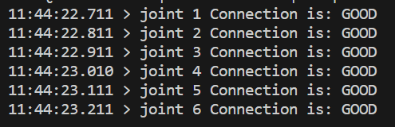
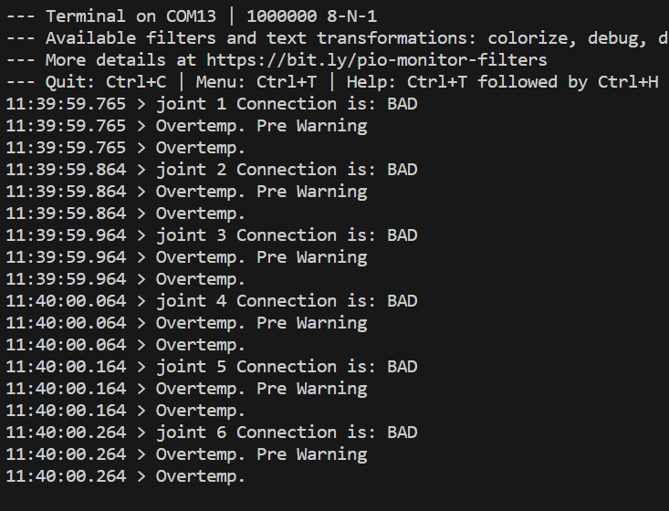
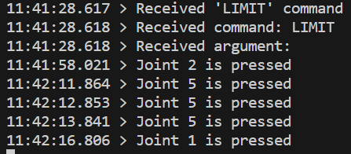
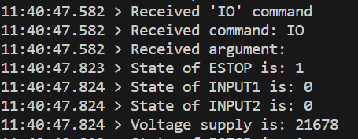
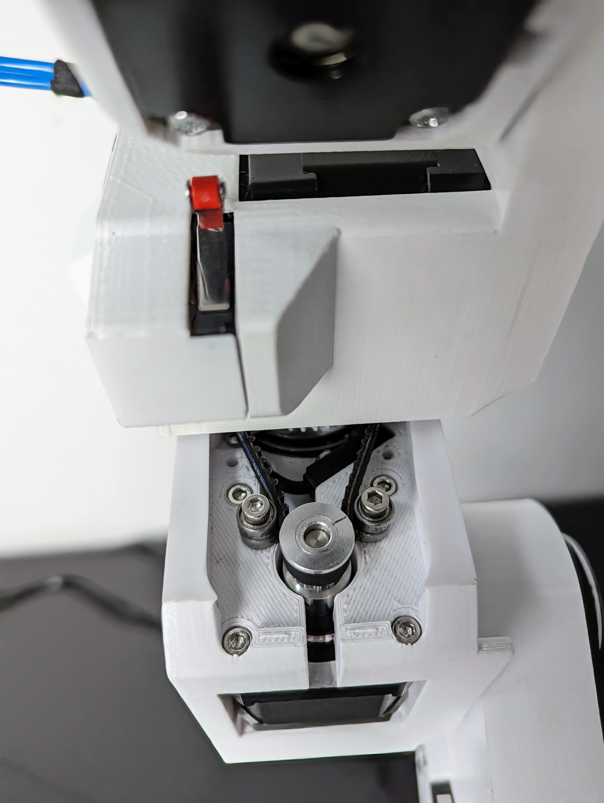
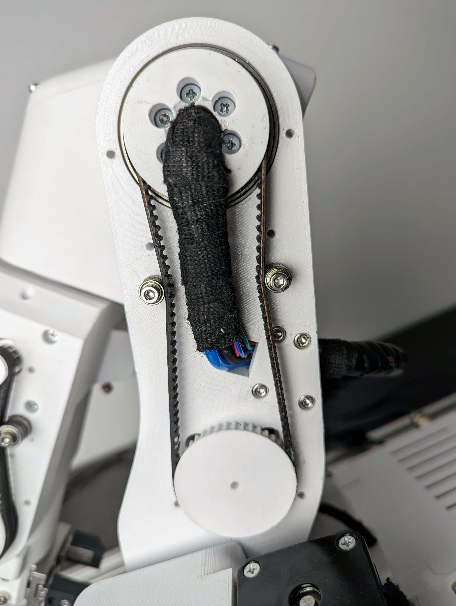
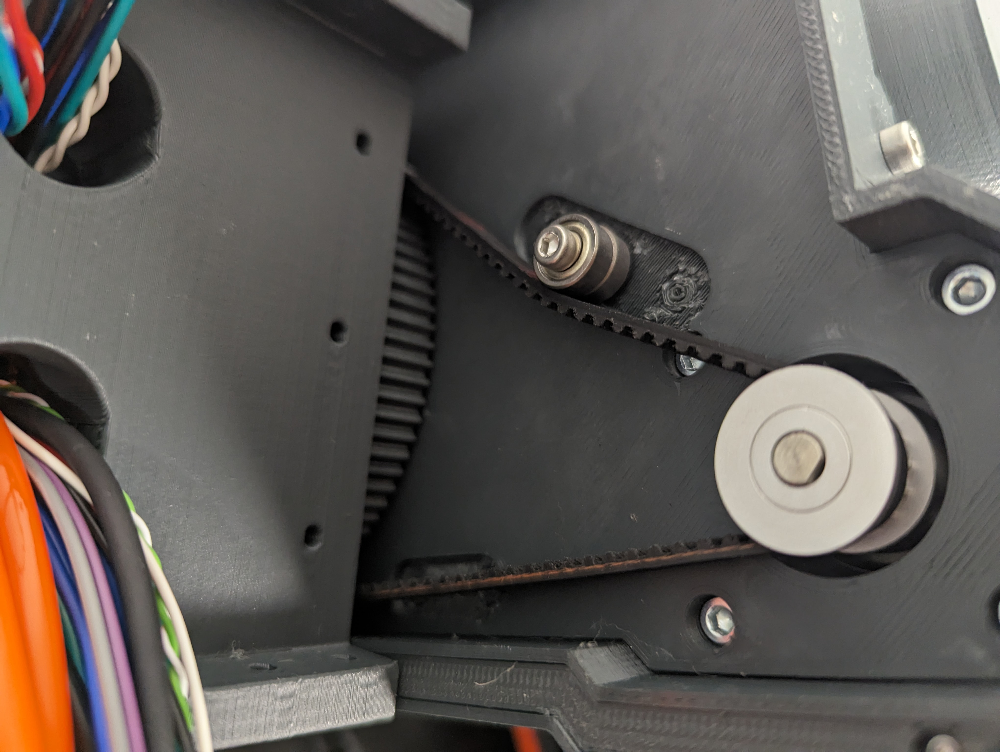

# **Getting started**

## **Assembly manual**

Assembly manual is located in [Github](https://github.com/PCrnjak/PAROL6-Desktop-robot-arm/tree/main/Building%20instructions) repository.  
If you decide to build it or buy a kit you will need to follow the assembly manual to make it.   
Assembly manual is also great tool for reparing and upgrading your robot. Make sure you use the latest version of the manual.  
Version is marked on the first page in the bottom left corner. 
Latest version is: v1 rev1 

After you have built the robot follow these steps to get it up and running!

## **How to follow this guide**

It is best to read the whole guide and then go step by step on each step. If you do something wrong you will have to go a few steps back so it is recommended to read or skim through this page.

## **Do not do this**

There are few things you should never do to your PAROL6.

!!! Warning annotate "Warning"

    Never spin joint 5 more then one rotation

The image above represents the range of J5.

!!! Warning annotate "Warning"

    If you dont have blockers on joint 1 there is possibility to spin it more then 1 rotation. Never do it!

!!! Warning annotate "Warning"

    Robot does not have brakes. When you power off your robot steppers will stop producting torque and ROBOT WILL FALL!  
    **Never turn off the robot without you holding it!**

## **SSG48 gripper**

If you plan to use [SSG48 gripper](https://github.com/PCrnjak/SSG-48-adaptive-electric-gripper) first make sure that your PAROL6 works and than attach it to the robot! 
Check the section in Peripherals on how to connect the gripper!

## **Powering on**

PAROL6 requires 3 connections for normal operation.

* Power connection -> Marked green on image

* USB connection -> Marked blue on image

* ESTOP -> Marked with yellow and pink squares (One lead of ESTOP goes to yellow one to pink)

If you upladed **main** software to the PAROL6 control board its on/off operation will work like this:  
First connect power cable (marked green). After that you can turn robot on and off by pressing power button (marked red). 
After you press the power button the robots joints will start producing torque. You will hear 6 clicking sounds, that is normal. 
Robot is now locked and it is waiting to receive commands.

!!! Warning annotate "Warning"

    Robot will power on by itself if you have connected 3v3 supply from the programming port. 

## **Stepper Induced voltage**

!!! Danger annotate "DO NOT SPIN UNPOWERED ROBOT WHEN CONNECTED TO SUPPLY"

    **Because stepper motors create voltage when spun, they can turn the robot on if you spin them.**  
    **After you turn off the robot move it to standby position slowly** 
    **Never randomly spin the robot when connected to power or you risk powering it on**

## **Powering off**

!!! Danger annotate "Do not try to power off the robot when it is running!"

    **If robot starts to behave unexpectedly USE ESTOP.**  
    **If ESTOP is not functional power of the supply.** 
    **Reaching for the power button should be the last option.**

Because lack of brakes sudden loss of power will result in robot falling down. That may cause damage to the robot or the operator.
Robot is powered on and off by pressing a button marked red on the image. When powering the robot on even when USB connection is not available it will energise the
the motors. It will produce 6 clicking sounds and that is normal behaviour. 

Powering off the robot is also done by pressing button marked in RED. Before you power off the robot **GRAB IT BY THE FOREARM** and then press the button. This will ensure that robot does not fall down. **THESE STEPS ARE MANDATORY** Failing to do so will damage your robot! 

!!! Warning annotate "Warning"

    You will not be able to power off the robot if there is external 3v3 (from the stlink for example)

## **Installing PAROL6 commander software**

Commander software can be located in [Github](https://github.com/PCrnjak/PAROL-commander-software) repository.  
Install instructions are located there.

Using requirements.txt  
CD into commander software folder  
pip install -r requirements.txt  

[Windows](https://github.com/PCrnjak/PAROL-commander-software/blob/main/Windows_install.md)

[Linux](https://github.com/PCrnjak/PAROL-commander-software/blob/main/Linux_install.md)

More info how to install can be found in the github folder.

## **Uploading PAROL6 control board code**

Microcontroller on PAROL6 control board is STM32F446RE. To upload code you need to use STlink device and connect its dedicated CLK, SWDIO, 3V3 and GND pins (Do not connect any other pin!). You can use jumper cables or [dedicated stlink + cable assembly](https://source-robotics.com/products/parol6-programming-adapter).

!!! Danger

    **Only use one of those 2 methods to program PAROL6 control board! Connecting STlink with a cable wihout adapter WILL KILL YOUR BOARD!** 

## **Uploading main control board code**

PAROL6 control boards are shipped fully tested with **TEST** code uploaded. You can use that test code to see if you connected your robot correctly to the control board. Main control board code is not the testing code. This code will be able to communicate with commander software.
You will need to have working commander software to use this code or build your own API. 

Upload the following code [Link](https://github.com/PCrnjak/PAROL6-Desktop-robot-arm/tree/main/PAROL6%20control%20board%20main%20software)

If you are having problems with code upload via Stlink try installing the drivers:
https://www.st.com/en/development-tools/stsw-link009.html

!!! Note annotate "If using SSG48 gripper"

    **In the main.cpp file change j5_homing_offset to be equal to 8035**  

## **PAROL6 control board**

!!! Warning annotate "Warning"

    When uploading code with stlink to the robot DISCONNECT THE 24V supply from the robot. 
    After the code is uploaded disconnect the stlink and connect power supply. 

Look at the PAROL6 control board page for more info.

## **First startup**

When first starting the robot (with main code uploaded) biggest and most common problem is that motors will turn in different directions from those they were supposed to move. There are 2 ways to fix this:  

* Open the robot base and replace wires of one of the stepper motor phases  
* **RECOMMENDED**-> Upload a new code to PAROL6 control board with small changes to the code

If you are going with code edit solution you will need to edit these segments of code: 

        file name: motor_init.cpp
        If rotating in wrong direction switch from 0 to 1 or 1 to 0
        The variable to change is:

        Joint__->direction_reversed = 1;

## **Homing**

Homing is a process where a robot joint finds a known position in its rotation space, typically by hitting a limit switch or sensor.

The process for PAROL6 and FAZE4 robots is the same as that for 3D printers. After powering up, the robot doesn't know its position and needs to be homed. By hitting a limit switch, we determine the robot joint's position based on our knowledge of the limit switch's location, which we have from the CAD model. For example, when we hit a limit switch on Joint 1, we know that we need x steps to reach a witness mark or Joint 1's 0-degree position.

Now that we know our position after homing and the number of steps required from the limit switch to the witness mark, you might think we're done, right? Well, not quite. To be really precise, after hitting the limit switch, you should observe how many steps it actually takes from the limit switch to the witness mark. Each PAROL6 build may have slight differences due to various printers, tolerance variations, and parts.

The Parol6 control board comes preloaded with generic parameters that will work for anyone building the robot. However, if you want to fine-tune your robot, you now have the option to do so.

By default PAROL6 homes in these steps:

* Joint 1,2 and 3 move to the limit switch at the same time
* Once all are pressed they move away from them and press again.
* Now joints 1,2 and 3 move to standby position
* Now joint 4 homes
* After joint 4 is homed it moves to its standby position
* Now Joint6 homes
* After it homes it goes to positon to home joint 5
* After joint5 homes joints 5 and 6 move to the standby position

Homing needs to look like shown in this [video!](https://www.youtube.com/watch?v=OCCQkIWPWwo&ab_channel=Sourcerobotics)

**Joints 1,4 and 6 home with inductive sensors make sure they trigger! If they do not trigger the LEDS on the sensors will not light up. To fix that you will need to adjust the screw that homes that joint**

!!! Warning annotate "Warning"

    **Joints 1,4 and 6 home with inductive sensors make sure they trigger!**  
    **Failing to adjust their trigger points you risk damaging the robot!**

!!! Note annotate "Note"

    **When starting homing procedure Joint 6 will rotate in the NEGATIVE DIRECTION TO FIND THE HOMING PIN!**  
    **Make sure that it does not make to much rotations or you risk wires/tubes getting tangled and braking/damaging your robot! ** 

You will need to place the gripper in the position like this. Note that J6 wil rotate in the direction of green arrow during homing. The red circle is location of homing pin and blue arrow indicated the location of the sensor.

!!! Note annotate "Note"

    **If using custom gripper make sure it has a spot that can trigger joint 5 limit switch!**  

    
## **Testing**

To test PAROL6 control board connection to your robot you can use stock software or use testing software.
Testing software is more safe and interactive for users. It can be found at: [Link](https://github.com/PCrnjak/PAROL6-Desktop-robot-arm/tree/main/PAROL6%20control%20board%20test%20code)

It is recommended to use testing code to test your components (for example test if Joint1 motor is spinning or does J3 limit switch works). 

!!! Danger annotate "Danger"

    **Using testing code on assembled robot may cause damage, only use it to test individual components and functions!**  

!!! Note annotate "Note"

    **This code will try to spin all the motors, so it is not safe to just upload it to your robot.**  

Upload the code with only usb connected and Programming adapter. Programming adapter will supply your board with 3v3 and if you configure your COM port you should be able to talk to your board. It will report errors for the stepper drivers since they need 24V to power on.

After you comfirmed that you can communicate; disconnect programming adapter and plug in 24V. Board will stay turned off until you do one of the 2 things:

* Turn the board by supplying 3v3 from the programming adapter.
* Attach power button. You will need to hold it pressed to keep the board powered.

### **PAROL6 control board testing software**

The code will try to communicate with stepper drivers. Output1 and Output will go from high to low every 1s and LED1 and LED2 will flash. If everything is ok you will get output like this on serial:

If stepper driver is faulty or not connected you will get:

If stepper drivers are good your stepper motors should spin at a low speed using moderate current of 200-300 mA.

### **LIMIT test**

In serial terminal write # LIMIT and press enter. You should get a output like this if you activate the switch.
For  limit switches orientation is also not important (one lead to 24V other to signal. For Inductive sensors:
Black - signal, Blue - negative, Brown - positive

### **IO**

In serial terminal write # IO and press enter. You should get a output like this:

If you change the state of ESTOP, INPUT1 or INPUT2 you will see states changing. You will also be able to see voltage of your power supply in mV!

## **Quick start guide**

* Attach the robot to table or workstation.
* Make sure you have PAROL6 control board that has main firmware on it!
* Connect power supply and USB to your robot.
* Test if you can move your robots joints freely.
* Turn on your power supply. **IT NEEDS TO BE 24V**
* Press the power button. Power button locks all the joints to the current position.
* After power button is pressed you can turn on commander software.
* Commander software has a menu at the bottom that allows you to select COM port if it is not correct in the source code
* If that option fails adjust your COM port in the commander code manually
* If you fail to connect check your COM port number again. If using linux use: sudo chmod 666 /dev/ttyACMx mutiple times
* After the commander software started you will see 2 windows: Simulator window and GUI window
* Simulator will not be calibrated to the robot and GUI will display wrong joint and cartesian coordinates.
* Go to joint jog menu and try to jog the motors.
* Arrows (OF THE JOG MENU) pointing to the left represent **POSITIVE** rotation of the joint and arrows pointing to the right **NEGATIVE**.
* Positive and negative rotations of the joints are shown on the image below

  

* Comfirm that every joint moves coresponding joint in right direction. If not follow first startup guide to callibrate them and only then return here.
* Once you adjusted your joint rotations repeat all the previous steps and confirm correct rotations.
* Press the home button. All joints of the robot will start to move. Be close to the estop of the robot. If you hear grinding noise when robot is close to the limit switch press the estop emediately. 
That means your estop for that joint is not working and you need to check your wiring. If you see that J6 is spinning mutiple times press ESTOP and adjust your inductive sensor trigger screw.
* If the robot homes correctly it will be in position as in the image above but J1 will be rotated for +90 degree. Small deviations are ok since your robot is still not mastered. 
* Simulator is now synchronized to the robot and GUI shows correct values.
* Congrats you have a functional PAROL6 robot to work with!

## **Output log**

In your terminal you will periodically see this data:

        ROBOT DATA:
        Position from robot is: [154, 0, 0, 0, 0, 0]
        Speed from robot is: [0, 0, 0, 0, 0, 0]
        Robot homed status is: [0, 0, 0, 0, 0, 0, 1, 1]
        Robot Input/Output status is: [0, 0, 0, 0, 1, 1, 1, 1]
        Robot temperature error status is: [0, 0, 0, 0, 0, 0, 1, 1]
        Robot temperature error status is: [0, 0, 0, 0, 0, 0, 1, 1]
        Timeout_error is: 100
        Time between 2 commands raw is: 7129
        Time between 2 commands in ms is: 0.010139022206380001
        XTR_DATA byte is: 255
        Gripper ID is: 255
        Gripper position is: -100
        Gripper speed is: 2000
        Gripper current is: -3000
        Gripper status is: 123
        Gripper object detection is: 69

        COMMANDED DATA:
        Robot Input/Output status is (OUT): [0, 0, 0, 0, 0, 0, 0, 0]
        Robot Commands is:  255
        Commanded robot speeds are: [0, 0, 0, 0, 0, 0]

        GUI DATA:
        Joint jog buttons: [0, 0, 0, 0, 0, 0, 0, 0, 0, 0, 0, 0]
        Cart jog buttons: [0, 0, 0, 0, 0, 0, 0, 0, 0, 0, 0, 0]
        Home button state:0
        Enable button state:0
        Disable button state:0
        Clear error button state:0
        Real robot state: 1
        Simulator robot state: 1
        Speed slider is: 50
        WRF/TRF is: 0
        Demo app button state: 0
        Shared string is: b'Log: Joint  1  jog  '
        Program execution variable: 0
        [255, 255, 255]
        b'\xff\xff\xff'
        [0, 1, 1, 1, 1, 0, 1, 1]
        b'\x00\xfcj\x03'
        0x0
        0xfc
        0x6a
        b'\x00'
        b'\xfc'
        b'j'
        fuesd
        -235005
        b'{'
        $$$$$$$$$$$$$$$$

This data tells you about the state of the GUI and the robot. What we are interested is the value of Time between 2 commands in ms. This variable needs to be in range of 0.010 s. Monitor it for a few minutes while you jog the robot. If it is in the range of 0.01 your PC can handle the commander software. If it is not in the range your PC is probably too week.

## **Mastering the robot**

### **Witness marks**

 In the context of robot arms, "witness marks" typically refer to marks or indicators that are used to verify or witness the alignment, position, or movement of components or parts within the robotic system. These marks can serve various purposes in robot arms and automation; but are usually used to master the robot.

Witness marks can be used during the calibration process to ensure that different components are properly aligned or positioned as per the specified configuration.

Parol6, Faze4, and CM6 robotic arms also have witness marks. These marks are indicated by holes in the mechanical parts, allowing the parts to be aligned by inserting a pin through those holes.

  

                        Figure: Witness marks of PAROL6 robot 

### **Robot mastering**

Mastering the robotic arm is the process of bringing your robots joints to the witness mark of that joint and recording the position that robot is at that point.

When at the position of the witness mark robots position is know because of our knowledge of robots kinematics and CAD. it basically assigns robots encoder ticks / stepper ticks to the know joint angle

Lets take an example of J1 of our PAROL6 robotic arm

  

                        Figure: Standby position of PAROL6 robotic arm

At this exact position our robots joint is at 0 degrees / 0 steps. If everything was perfect you would place a pin at the witness marks and it would fit with no problems.  

    In the code you can edit homed_position to adjuct your robot mastering
    /// @brief how much steeps need to be made from when limit is hit to standby position
    float homed_position 

## **Maintenance**

### **Belts**

We recommend to periodically check your belt tension and apply greese to the belts. If you see that the belt is not tight enough place another tension bearing as shown in the pictures. 

Belts are located on Joints: 1,3,4,5

#### **Joint 5 belt**

  

#### **Joint 4 belt**

  

#### **Joint 3 belt**

  

#### **Joint 1 belt**

  

Use [This video](https://www.youtube.com/watch?v=v0PYfEoIr3k&ab_channel=Sourcerobotics) as a reference for belt tension! In the video we apply max force we can with the hands to the belt. You can use the belts "stretching" as a reference for your belt. Belts for J1 and J4 need to have a bit less tension on them.

### **Couplers and threadlocker**

In case your joint starts to slip your set screw probably slipped. Tighten them again and make sure you use blue threadlocker.
To be safe after you apply do not touch the robot for 24h. Also make sure you place screws in the keyhole!
Threadlocker should be applied to all metal mating surfaces. **Due the vibrations these parts will get lose screws.**

