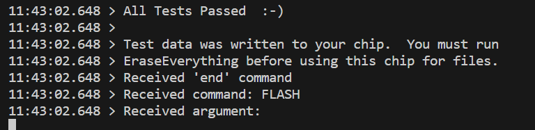

# Getting started

## Assembly manual

Assembly manual is located in [Github](https://www.mkdocs.org) repository.  
If you decide to build it or buy a kit you will need to follow the assembly manual to make it.   
Assembly manual is also great tool for reparing and upgrading your robot. Make sure you use the latest version of the manual.  
Version is marked on the first page in the bottom left corner. 
Latest version is: v1 rev1 

After you have built the robot follow these steps to get it up and running!

## Do not do this

There are few things you should never do to your PAROL6.

!!! Warning annotate "Warning"

    Never spin joint 5 more then one rotation

The image above represents the range of J5. 

!!! Warning annotate "Warning"

    If you dont have blockers on joint 1 there is possibility to spin it more then 1 rotation. Never do it!

!!! Warning annotate "Warning"

    Robot does not have brakes. When you power off your robot steppers will stop producting torque and ROBOT WILL FALL!  
    **Never turn off the robot without you holding it!**

## Powering on 

PAROL6 requires 3 connections for normal operation.

* Power connection -> Marked green on image

* USB connection -> Marked blue on image

* ESTOP -> Marked with yellow and pink squares (One lead of ESTOP goes to yellow one to pink)

If you upladed software to the PAROL6 control board its on/off operation will work like this:  
First connect power cable (marked green). After that you can turn robot on and off by pressing power button (marked red). 
After you press the power button the robots joints will start producing torque. You will hear 6 clicking sounds, that is normal. 
Robot is now locked and it is waiting to receive commands.

## Powering off

!!! Danger annotate "Do not try to power off the robot when it is running!"

    ** If robot start to behave unexpectedly USE ESTOP.**  
    ** If ESTOP is not functional power of the supply.** 
    ** Reaching for the power button should be the last option.**

Because lack of brakes sudden loss of power will result in robot falling down. That may cause damage to the robot or the operator.
Robot is powered on and off by pressing a button marked red on the image. When powering the robot on even when USB connection is not available it will energise the
the motors. It will produce 6 clicking sounds and that is normal behaviour. 

Powering off the robot is also done by pressing button marked in RED. Before you power off the robot **GRAB IT BY THE FOREARM** and then press the button. This will ensure that robot does not fall down. **THESE STEPS ARE MANDATORY** Failing to do so will damage your robot! 

!!! Warning annotate "Warning"

    You will not be able to power off the robot if there is external 3v3 (from the stlink for example)

## Installing PAROL6 commander software

Commander software can be located in [Github](https://github.com/PCrnjak/PAROL-commander-software) repository.  
Some prerequisites you will need to have are:  

* python  
* pip3  

Commander software was tested on machines with these specifications:  

* Windows 10, Ryzen 5, 32gb ram, Nvidia 3060   
* Windows 10,   

## PAROL6 control board 

!!! Warning annotate "Warning"

    When uploading code with stlink to the robot DISCONNECT THE 24V supply from the robot. 
    After the code is uploaded disconnect the stlink and connect power supply. 

Look at the PAROL6 control board page.

## First startup

When first starting the robot biggest and most common problem is that motors will turn in different directions from those they were supposed to move. There are 2 ways to fix this:  
* Open the robot base and replace wires of one of the stepper motor phases  
* **RECOMMENDED**-> Upload a new code to PAROL6 control board with small changes to the code

If you are going with code edit solution you will need to edit these segments of code: 

        file name: motor_init.cpp
        If rotating in wrong direction switch from 0 to 1 or 1 to 0
        Joint__->direction_reversed = 1;

## Homing

Homing is a process where a robot joint finds a known position in its rotation space, typically by hitting a limit switch or sensor.

The process for PAROL6 and FAZE4 robots is the same as that for 3D printers. After powering up, the robot doesn't know its position and needs to be homed. By hitting a limit switch, we determine the robot joint's position based on our knowledge of the limit switch's location, which we have from the CAD model. For example, when we hit a limit switch on Joint 1, we know that we need xxx steps to reach a witness mark or Joint 1's 0-degree position.

Now that we know our position after homing and the number of steps required from the limit switch to the witness mark, you might think we're done, right? Well, not quite. To be really precise, after hitting the limit switch, you should observe how many steps it actually takes from the limit switch to the witness mark. Each PAROL6 build may have slight differences due to various printers, tolerance variations, and parts.

The Parol6 control board comes preloaded with generic parameters that will work for anyone building the robot. However, if you want to fine-tune your robot, you now have the option to do so.

    By default PAROL6 homes in these steps:
    * Joint 1,2 and 3 move to the limit switch at the same time
    * Once all are pressed they move away from them and press again.
    * Now joints 1,2 and 3 move to standby position
    * Now joint 4 homes
    * After joint 4 is homed it moves to its standby position
    * Now Joint6 homes
    * After it homes it goes to positon to home joint 5
    * After joint5 homes joints 5 and 6 move to the standby position

** Joints 1,4 and 6 home with inductive sensors make sure they trigger! **

!!! Warning annotate "Warning"

    ** Joints 1,4 and 6 home with inductive sensors make sure they trigger! **  
    ** Failing to adjust their trigger points you risk damaging the robot! **

!!! Note annotate "Note"

    ** When starting homing procedure Joint 6 will rotate in the NEGATIVE DIRECTION TO FIND THE HOMING PIN!**  
    ** Make sure that it does not make to much rotations or you risk wires/tubes getting tangled and braking/damaging your robot! ** 

!!! Note annotate "Note"

    ** If using custom gripper make sure it has a spot that can trigger joint 5 limit switch!**  

    
## Testing

To test PAROL6 control board connection to your robot you can use stock software or use testing software.
Testing software is more safe and interactive for users. It can be found at: [Link](https://github.com/PCrnjak/PAROL6-Desktop-robot-arm/tree/main/PAROL%20control%20board%20software)

### PAROL6 control board testing software

The code will try to communicate with stepper drivers. Output1 and Output will go from high to low every 1s and LED1 and LED2 will flasg. If everything is ok you will get output like this on serial:

If stepper driver is faulty or not connected you will get:

If stepper drivers are good your stepper motors should spin at a low speed using moderate current of 200-300 mA.

### Flash memory test

In serial terminal write # FLASH and press enter. You should get a output like this for successful test. 

### LIMIT test

In serial terminal write # LIMIT and press enter. You should get a output like this if you activate the switch.

### IO 

In serial terminal write # IO and press enter. You should get a output like this:

If you change the state of ESTOP, INPUT1 or INPUT2 you will see states changing. You will also be able to see voltage of your power supply in mV!

## Quick start guide

* attach the robot to table or workstation..
* Make sure you have driver board that has firmware on it!
* Connect power supply and USB to your robot.
* Test if you can move your robots joints freely.
* Move the robot close to the position shown on the image. 
* Press the power button. Power button locks all the joints to the current position.
* After power button is pressed you can turn on commander software.
* After the commander software started you will see 2 windows: Simulator window and GUI window
* Simulator will not be calibrated to the robot and GUI will display wrong joint and cartesian coordinates.
* Go to joint jog menu and try to jog the motors.
* Arrows pointing to the left represent negative rotation of the joint and arrows pointing to the right positive.
* Positive and negative rotations of the joints are shown on the image below
* Comfirm that every joint moves coresponding joint in right direction. If not fallow the above guide to calibrate it.
* Once you adjusted your joint rotations repet all the previous steps and confirm correct rotations.
* Press the home button. All joints of the robot will start to move. Be close to the estop of the robot in case the estops stop working or robot crashed. If you hear grinding noise when robot is close to the limit switch press the estop emediately.
That means your estop for that joint is not working and you need to check your wiring.
* If the robot homes correctly it will be in this position. Small deviations are ok since your robot is still not calibrated 
* Simulator is now sinced to the robot and GUI shows correct values.
* Congrats you have a functional PAROL6 robot to work with!

## Mastering the robot

### Witness marks

 In the context of robot arms, "witness marks" typically refer to marks or indicators that are used to verify or witness the alignment, position, or movement of components or parts within the robotic system. These marks can serve various purposes in robot arms and automation; but are usually used to master the robot.

Witness marks can be used during the calibration process to ensure that different components are properly aligned or positioned as per the specified configuration.

Parol6, Faze4, and CM6 robotic arms also have witness marks. These marks are indicated by holes in the mechanical parts, allowing the parts to be aligned by inserting a pin through those holes.

  

                        Figure: Witness marks of PAROL6 robot 

### Robot mastering

Mastering the robotic arm is the process of bringing your robots joints to the witness mark of that joint and recording the position that robot is at that point.

When at the position of the witness mark robots position is know because of our knowledge of robots kinematics and CAD. it basically assigns robots encoder ticks / stepper ticks to the know joint angle

Lets take an example of J1 of our PAROL6 robotic arm

  

                        Figure: Standby position of PAROL6 robotic arm

At this exact position our robots joint is at 0 degrees / 0 steps. If everything was perfect you would place a pin at the witness marks and it would fit with no problems.  

    In the code you can edit homed_position to adjuct your robot mastering
    /// @brief how much steeps need to be made from when limit is hit to standby position
    float homed_position 

## Maintenance

### Belts

We recommend to periodically check your belt tension and apply greese to the belts. If you see that the belt is not tight enough place another tension bearing as shown in the pictures. 

Belts are located on Joints: 1,3,4,5

#### Joint 5 belt

  

#### Joint 4 belt

  

#### Joint 3 belt

  

#### Joint 1 belt

  

### Couplers and threadlocker

In case your joint starts to slip your set screw probably slipped. Tighten them again and make sure you use blue threadlocker.
To be safe after you apply do not touch the robot for 24h. Also make sure you place screws in the keyhole!

