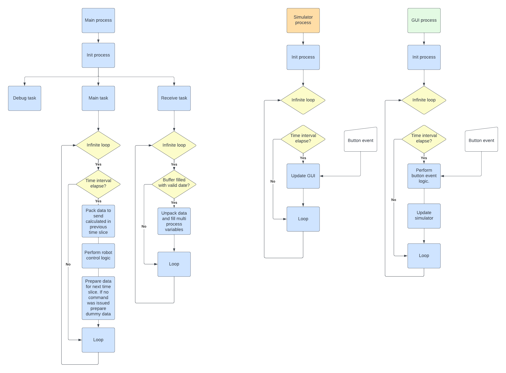
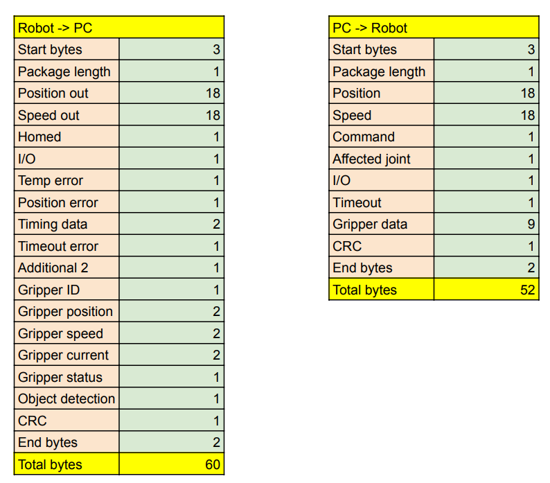
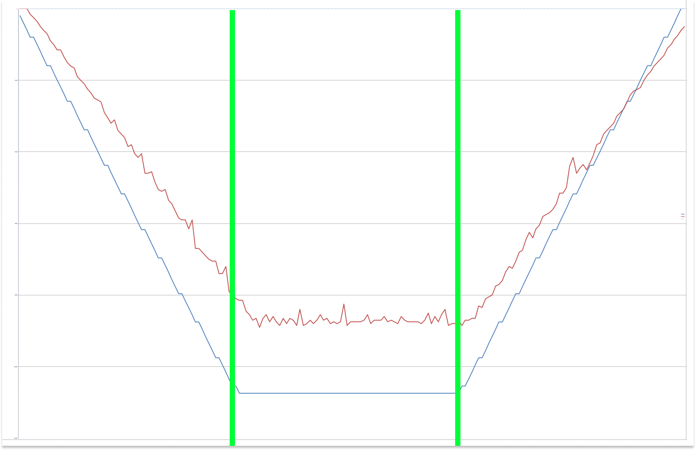
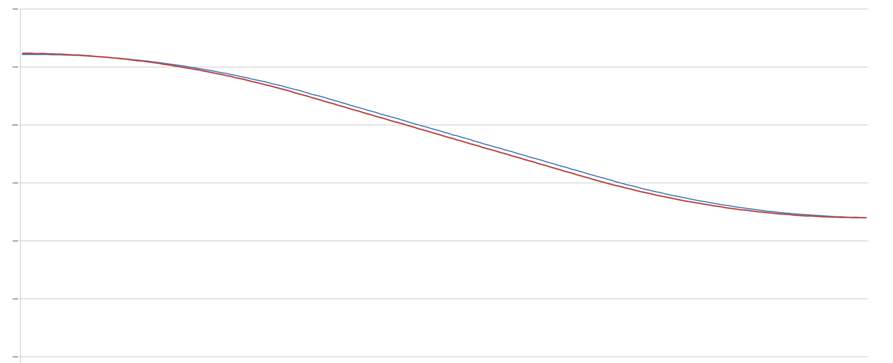
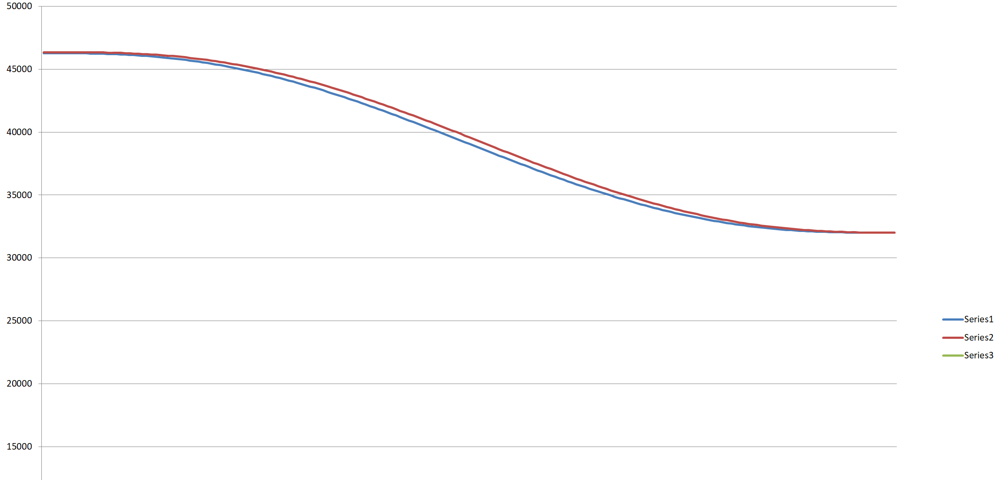

# **Software**

---

 To operate PAROL6 robot you need a: 

 * High level software running on your PC
 * Low level software running on PAROL6 control board

 For high level software there are multiple options:

 * Use PAROL6 commander software for control, programming, simulating
 * Use our API to send command thru your languange of choice Matlab, python, c++
 * Use ROS

 For low level software only PAROL6 control board software is available.
 PAROL6 commander software allows you to write simple robot arm scripts. Scripting language is called RBTscript.

---

## **Python API**

!!! Tip annotate "Commander alternative"

    Alternative to the commander software is controling the robot with python API. 
    More info and guide can be found in the github repo: [Link](https://github.com/PCrnjak/PAROL6-python-API)  

---

## **PAROL6 commander software**

Commander software can be found here: [https://github.com/PCrnjak/PAROL-commander-software](https://github.com/PCrnjak/PAROL-commander-software) 
PAROL6 commander software was writen in python. Its main purpase is to offer an interactive GUI for users to use to control and program PAROL6 robot. 

Some of the features that PAROL6 commander software has:

* Built in robot simulator 
* Built in programming language RBTscript
* Control loops of up to 100Hz
* Robot jog in joint and cartesian space
* Input and Output control
* View of robot telemetry data 
* Estop and safety functions

---

### **Structure**

---

### **Dependancy**

Latest stable version uses python 3.11.0 and following dependencies:

* Check dependancy here: [https://github.com/PCrnjak/PAROL-commander-software](https://github.com/PCrnjak/PAROL-commander-software)

---

### **How to run / Install**

* First install proper python version
* Install all dependencies
* clone or download [https://github.com/PCrnjak/PAROL-commander-software](https://github.com/PCrnjak/PAROL-commander-software)
* Run the Serial_sender_good_latest.py

---

## **PAROL6 control board software**

We recommend using VS Code and platformio to install, edit and run the  code. 

---

### **PAROL6 control board software Install guide**

* Insall VS Code: [https://code.visualstudio.com/](https://code.visualstudio.com/)
* In the VS Code extensions install Platformio
* Clone [https://github.com/PCrnjak/PAROL6-Desktop-robot-arm](https://github.com/PCrnjak/PAROL6-Desktop-robot-arm) or download zip folder
* In VS Code click open folder and select "PAROL control board" from previously downloaded folder
* Now Platformio should download all necesarry configurations to allow you to compile and upload code

---

### **Code upload to PAROL6 control board software**
To upload code on your PAROL6 board you need a programming cable and stlink device 
If you followed the steps from "PAROL6 control board software Install guide" you should be able to upload code to your PAROL6 PCB from VS Code.

Programming adapter needs to be connected to the black connector next to the USB. Needed connections are 3v3, gnd, swdio, clk.

---

### **How to test PAROL6 control board?**

To test PAROL6 control board special testing software was made.
You can find it at: [https://github.com/PCrnjak/PAROL6-Desktop-robot-arm](https://github.com/PCrnjak/PAROL6-Desktop-robot-arm) in TESTING folder.

This code will allow you to control idividual functions of PAROL6 robot arm (if wired as per wiring instructions).

---

## **Communication protocol**

Communication is based on UART and is being done over USB cable from the robot to the PC. The usual baud rate is 3Mbit. Data is sent to the robot at 100Hz (If your PC is not good enough this can be decrease but performance will suffer). Data is sent in specially packed compact data packets. 

        Figure: Data packets in table format. As you can see both packets combined have less then 120 bytes. 
        With transmission speed of 3Mbit it takes 0.3 ms for a whole round trip of data!

Robot needs to receive valid data packet in the format defined above. 
Pseudo code of how it works on PAROL6 control board:

    While(1){

        Perform tasks
        
        While (Serial data available){
            * input byte = read serial data, This reads one byte from the buffer
            * First condition is that 3 start bytes are correct.
            * Once Len byte is received we know how many bytes we need to get.
            * After we get that number of bytes we check end bytes and CRC.
            * After that we proces the data, unpack it and save in corensponding variables.
            * After that we pack the robots telemetry data we will need to send to the PC

        }

    }

So if a robot receives good data packet, meaning good first 3 bytes, len, CRC and end bytes we can start to proces the data. That signals start of one robot loop cycle.

 Duty of PC (or any other device you wish to use to control your PAROL6) is to send data at sufficiently fast loop times. Time between 2 last commands is returned by PAROL6 control board in variable Timing data. 
 Timing data is variable that is 2 bytes long.  

* Freq is 90Mhz, with 128 prescale we get 703125, timer is 16bit
* It counts to 65535. 1 Tick is then equal to 1/703125 = 1.422222e-6
* To get 10 ms we need 7031 ticks

By viewing that variable you can check if your loop times are correct.

---

### **PC -> robot**

The protocol from PC -> robot consists of three types of commands:

* Active 
* Passive 
* Carrier 

The protocol from robot - PC consists only of robots telemetery data.

---

#### **List of active commands**

Active commands can only be given by the "command" argument and is represented by one byte. That means there can only be 255 possible  commands.

    0X123 - JOG
    0x156 - Go 2 positon with speed
    0X100 - Home command
    0x101 - Enable robot
    0x102 - Disable robot
    0x103 - Clear error
    0x255 - Dummy data

---

#### **Passive commands**
Passive commands are for example io commands and gripper commands. They are always sent with the data packet. Passive commands do not affect movement of the robot joints and by that can be injected in any active command. 

---

#### **Carrier commands**

Carrrier commands are joint speeds and positions that are modifiers for active movement commands. 

---

#### **Robot input packet (PC -> robot)**

    uint8_t start_bytes[] = {0xff, 0xff, 0xff};         // 3 byte
    int len = 52;                                       // 1 byte
    int Joints[6];                                      // each joint is 3 bytes; total of 18 bytes
    int Speed[6];                                       // each joint is 3 bytes; total of 18 bytes
    int Command = 255;                                  // 1 byte
    int Affected_joint[] = {1, 1, 1, 1, 1, 1, 1, 1};    // 1 byte
    int InOut[] = {1, 1, 1, 1, 1, 1, 1, 1};             // 1 byte
    int Timeout;                                        // 1 byte
    int Gripper_position;                               // 2 byte
    int Gripper_speed;                                  // 2 byte
    int Gripper_current;                                // 2 byte
    int Gripper_command;                                // 1 byte
    int Gripper_mode;                                   // 1 byte
    int Gripper_ID = 212;                               // 1 byte
    int CRC_byte = 212;                                 // 1 byte
    int end_bytes[] = {0x01, 0x02};                     // 2 byte

---

### **Robot output packet (ROBOT -> PC)**

Data sent from the robot to the PC consists only of robots telemetry data and flags.

    uint8_t start_bytes[] = {0xff, 0xff, 0xff};             // 3 byte
    int len = 56;                                           // 1 byte
    int Position_out[] = {255, 254, 253, 252, 251, 250};    // each joint is 3 bytes; total of 18 bytes
    int Speed_out[] = {245, 244, 243, 242, 241, 240};       // each joint is 3 bytes; total of 18 bytes
    bool Homed[] = {1, 1, 1, 1, 1, 1, 1, 1};                // 1 byte
    bool IO_var[] = {0, 0, 0, 0, 0, 0, 0, 0};               // 1 byte
    bool temp_error[] = {1, 1, 1, 1, 1, 1, 1, 1};           // 1 byte
    bool position_error[] = {0, 0, 0, 0, 0, 0, 0, 0};       // 1 byte
    int timing_data = 255;                                  // 2 byte
    int timeout_error = 244;                                // 1 byte
    int xtr2 = 255;                                         // 1 byte
    int gripper_ID = 200;                                   // 1 byte
    int gripper_position = 300;                             // 2 byte
    int gripper_speed = 300;                                // 2 byte
    int gripper_current = 300;                              // 2 byte
    int gripper_status = 200;                               // 1 byte
    int object_detection = 1;                               // 1 byte
    int CRC_byte = 212;                                     // 1 byte
    int end_bytes[] = {0x01, 0x02};                         // 2 byte

---

## **PAROL6 commander software**

---

### **Structure**

---

### **How to run / Install**

Check here: [https://github.com/PCrnjak/PAROL-commander-software](https://github.com/PCrnjak/PAROL-commander-software)

---

## **PAROL6 control board software**

Structure of the code:

---

### **PAROL6 control board software API**

---

### **Code upload to PAROL6 control board software**
To upload code on your PAROL6 board you need a programming cable and stlink device

---

## **Python API**

Python API to control PAROL6 via custom python scripts, terminal or LLMs: [Link](https://github.com/PCrnjak/PAROL6-python-API) 

---

### **RBTscript**

PAROL6 commander software allows you to write simple robot arm scripts. Scripting language is called RBTscript. It allows you to move the robot in joint space or cartesian space, use delay functions, control outputs and grippers, read inputs and much more!

---

### **Introduction**

Commands are executed sequentally.
they have tact of loop time!

---

### **Units used**

There is a lot of conversion of units in robotics and PAROL6 is not an exception to that. To keep things simple and accurate we compiled where these conversions happen, why and how.

---

#### **Angle**

Units for angles used in PAROL6 commander software are DEGREES. What we are sending PAROL6 control board are STEPS. For all calculations used in PAROL6 commander software RADIANS are used.

---

#### **Distance**

Units for distance used in PAROL6 commander software are milimeter [mm]. In the backend meters are used for all caculations

---

#### **Speed**

In the GUI speeds setpoints can only be set using %. 
Units of speed used in PAROL6 commander software backend are either STEPS/s , RAD/s or DEG/s for rotations or mm/s or m/s for translations. 

---

#### **Acceleration**
In the GUI acceleration setpoints can only be set using %.  
Units of acceleration used in PAROL6 commander software backend are either STEPS/s*s , RAD/s*s or DEG/s*s for rotations or mm/s*s or m/s*s for translations. In the GUI acceleration setpoints can only be set using %.

#### **How to write code!**

#### **How are trajectories generated?**

#### **How are they tracked?**

There are 2 ways we can command robots trajectory: 
For example we want joint 6 to move from 260 deg to 180 degree. We want to follow trap velocity profile and get to 260 position in 2  seconds. We generated speed and position curves.  
Now if we command only the speed curve robot will follow it perfectly but if the move is too long or too fast it will miss the demanded  positon. Why? 
We are sending commands every 10 ms. but it is not always exactly 10 ms since your PC is not real time machine. Another thing is that steppers cant execute some really small speed moves from the begging and the ends of the speed curve. Because of that positon is missed usually.  
How to compensate that? Using the  position curve! Using current positon and commadned positon we calculate how fast you need to go. After that take that speed and add commanded speed from the speed curve and average that. This gives the results you can see in the plots below.
In commands MoveJoint, MovePose, MoveCart and MoveCartRelTRF following only with speed or speed + positon can be selected by "speed" argument. 

          Figure: Trapezoidal velocity profile. BLUE is commanded velocity profile and RED is actual robot speed. 
           These diagrams are for mode where both positon and speed are commanded and avg was taken. Green lines 
           show that robot is 1/3 of the path in acceleration 1/3 in cruise and 1/3 in deceleration.

            Figure: Positon curve when following only with speed vs speed + positon.  
            You can see they are both really close but with speed and positon robot comes to  
            exactly the commanded positon. This plot is for trapezoidal velocity profile.

            Figure: This is same commanded positon but with polynomial. 
             As you can see same applies as for trapezoidal

### **Functions**

---

#### **MoveJoint(j1,j2,j3,j4,j5,j6,v=0,a=0,t=0,func,speed)**

Robot will move all its joints to the desired positons tracking a specific velocity curve. Joints will stop at the same time
at the desired positons. The path is linear in joint space, because of that actuator motion is easy to validate and predict but TRF/end-effector is hard to predict.
Can track trapezoidal velocity profile or polynomial veloctiy profile. 
User can set desired duration of the move or specific acceleration and velocity.  
The move can be tracked based on speed curve alone or combination of commanded speed curve and position curve.

* j1,j2,j3,j4,j5,j6 -> desired joint values [degrees] *REQUIRED ELEMENT*
* a -> desired acceleration and deaceleration of leading joint [% from 0 - 100] *OPTIONAL ELEMENT*
* v -> speed of leading joint (Joint that needs to travel the longest) [% from 0 - 100] *OPTIONAL ELEMENT*
* t -> desired duration of the move [s] *OPTIONAL ELEMENT*
* func -> can be "poly" or "trap" [no unit] *OPTIONAL ELEMENT*
* speed -> can be speed or nothing [no unit] *OPTIONAL ELEMENT*

Arguments need to be given in above defined order! 

If t is defined robot will finish its move in that defined time. t overrides a and v if they are given. Here default func is "poly". Even if it is not defined robot will use "poly". In case you want to use trapezoidal profile use func "trap". When using trapezoidal profile and t is defined speed profile will be 1/3 acceleration, 1/3 cruise speed, 1/3 deaceleration. 
Example:

    MoveJoint(0,-90,180,0,0,180,t=4)

If both a and v are defined robot will try to move at those specified speeds. When a and v are defined robot can only use trapezoidal profiles and they are automatically selected you do not need to define func as "trap". Specified a and v are applied to LEADING joint, that is the joint that will need to travel the longest. Because of that a and v percenteges that will work for LEADING joint will not necesarry work for other joints. If they do not work control algorithm will select proper move profile indepentand on a and v values. values will then be selected by this rule needed and initial are not the same but path is really small use 1/3 acc, 1/3 cruise and 1/3 deac. 
Example:

    MoveJoint(0,-90,180,0,0,180,v=50,a=50)

If only j1,j2,j3,j4,j5,j6 are given and no other variable joints algorithm       will use small conservative speed and acceleration. "trap" function will be used. 
Example:

    MoveJoint(0,-90,180,0,0,180)

In case you define your last arguments as speed, the robot will only follow the speed curve of the generated trajectory. It will generate motion that is more silent and smooth but will miss its desired position.  
Example: 

    MoveJoint(0,-90,180,0,0,180,speed)

Example commands and explanation: 

---

#### **MovePose(x,y,z,Rx,Ry,Rz,v=0,a=0,t=0,func,speed)**

Robot will move all its joints to the desired *orientation* tracking a specific velocity curve. Joints will stop at the same time
at the desired positons. The path is linear in joint space, because of that actuator motion is easy to validate and predict but TRF/end-effector is hard to predict.
Can track trapezoidal velocity profile or polynomial. 
User can set desired duration of the move or specific acceleration and velocity.  
The move can be tracked based on speed curve alone or combination of commanded speed curve and position curve.

* x,y,z,Rx,Ry,Rz -> desired robot pose. x,y,z are in [mm]; Rx,Ry,Rz are in [degrees] *REQUIRED ELEMENT*
* a -> desired acceleration and deaceleration of leading joint [% from 0 - 100] *OPTIONAL ELEMENT*
* v -> speed of leading joint (Joint that needs to travel the longest)[% from 0 - 100] *OPTIONAL ELEMENT*
* t -> desired duration of the move [s] *OPTIONAL ELEMENT*
* func -> can be "poly" or "trap" [no unit] *OPTIONAL ELEMENT*
* speed -> can be speed or nothing [no unit] *OPTIONAL ELEMENT*

Arguments need to be given in above defined order! 

Rules that apply to MoveJoint() are same for MovePose. Code is the same except that control algoritam will calculate joint angles using inverse kinemtics from needed robot pose. Because of that you might end up with robot joint configuration that is not same as one that you wanted.

Example commands and explanation: 

#### **SpeedJoint()**

---

#### **MoveCart(x,y,z,Rx,Ry,Rz,t=0,func,speed)**

Robot will move all its joints to the desired *orientation* tracking a specific velocity curve. Joints will stop at the same time at the desired positons. The path is linear in tools / task    space, Actuator motion not necessarily smooth and harder to validate. Can track trapezoidal velocity profile or polynomial. With this mode robot cant pass singularities and is affected by them. Note that when robot gets close to singularity it will stop. Robot will try to exectute the trajectory even if it has singularity in it. User needs to make sure their robot can pass thru the singularity by properly designing the task and robotic cell.  
User can set desired duration of the move with variable t.  

Arguments need to be given in above defined order! 

* x,y,z,Rx,Ry,Rz -> desired robot pose with respest to WRF. x,y,z are in [mm]; Rx,Ry,Rz are in [degrees] *REQUIRED ELEMENT*
* t -> desired duration of the move [s] *OPTIONAL ELEMENT*
* func -> can be "poly" or "trap" [no unit] *OPTIONAL ELEMENT*
* speed -> can be speed or nothing [no unit] *OPTIONAL ELEMENT*

Example commands and explanation: 

---

#### **MoveCartRelTRF(x,y,z,Rx,Ry,Rz,t=0,func,speed)**

Unlike MoveCart where pose is defined with respect to WRF in MoveCartRelTRF we are moving robot pose relative to current Tool reference frame. With this mode robot cant pass singularities and is affected by them. Note that when robot gets close to singularity it will stop. Robot will try to exectute the trajectory even if it has singularity in it. User needs to make sure their robot can pass thru the singularity by properly designing the task and robotic cell.

* x,y,z,Rx,Ry,Rz -> pose arguments relative to TRF. x,y,z are in [mm]; Rx,Ry,Rz are in [degrees] *REQUIRED ELEMENT*
* t -> desired duration of the move [s] *OPTIONAL ELEMENT*
* func -> can be "poly" or "trap" [no unit] *OPTIONAL ELEMENT*
* speed -> can be speed or nothing [no unit] *OPTIONAL ELEMENT*

When rotating around x, y and z using Rx ,Ry, Rz it is recommended to make 2 succesive commands.
Example:

    MoveCartRelTRF(0, 0, 0, 0, 45, 0) 
    MoveCartRelTRF(0, 0, 0, 0, 0, 45)

Example commands and explanation: 

---

#### **Delay()**

Delays the script by specific time in seconds [s]. 
Note that smallest delay can be equal to INTERVAL_S variable (loop time of the robot arm, usually 10ms) 
Example:  

    Delay(1.5) // Adds time delay of 1.5s 

---

#### **End()**

Intidates that script will stop exectuing at this moment
Example:

    End()

---

#### **Begin()**

Indicates that script will begin.
Example:

    Begin()

---

#### **Loop()**

When script reaches this command it will start executing from the beginning.
Example:

    Loop()

---

#### **Output()**

Sets one of the 2 outputs HIGH or LOW. 
Example:

    Output(1, HIGH) // sets output 1 of PAROL6 control board to HIGH state
    Output(2, LOW) // sets output 2 of PAROL6 control board to LOW state

---

#### **Gripper_cal()**

This command will calibrate and activate the gripper. After calling it place a delay in the code to let it execute.
Example:

    Gripper_cal()
    Delay(2)

---

#### **Gripper(position,speed,current)**

Gripper allows you to control SSG48 gripper connected to your PAROL6 robot.

* Position sets the positon setpoint of the gripper; ranges from 0 - 255; 0 fully open 255 fully closed
* Speed sets the move speed of the gripper ranges from 0 to 255; 0 lowest speed 255 full speed
* Current sets the force the gripper will apply to the object ranges from 0 - 1300 [mA]; *Note values smaller than 150 will usually be to low to move the gripper
!!! Danger annotate "be carefull when using large current values (over 700) paired with high speed setpoint they can case damage to you and objects that are being grasped"

When using gripper command after being called the program will move to the next command. So it is recommended to use Delay() after calling gripper command. 
Example: 

    Gripper(120,30,500) // Move the gripper to positon 120 with speed of 30 and with current setpoint of 500mA
    Delay(2)

---

### **Example codes**

---

#### **Simple Joint space move code**
This code will perfrom small joint space movements in the loop.

    Begin()
    Delay(1)
    MoveJoint(85.078,-111.195,143.513,-32.92,18.084,129.448,t=3)
    Delay(1)
    MoveJoint(66.129,-117.368,136.77,46.28,-29.588,149.293)
    Delay(1)
    Loop()

---

#### **Cartesian TRF example code**
This code will move the robot in TRF space. First translation in x,y,z direction then rotation around x,y,z of TRF. 
*Note look at the simulator window to see how the robot follows the axes.

    Begin()
    Delay(1)
    MoveJoint(90.0,-90.0,180.001,0.0,0.0,180.0,t=4)
    Delay(1)
    MoveCart(0.0,263.23,161.241,-90.0,0.0,-89.499)
    Delay(1)
    MoveCart(81.565,262.804,161.047,-90.135,-0.029,-89.578)
    Delay(1)
    MoveCart(81.649,194.981,160.077,-90.14,-0.043,-89.593)
    Delay(1)
    MoveCart(83.598,194.356,161.493,-91.155,1.306,-80.28)
    Delay(1)
    MoveCart(84.56,194.131,162.347,-48.387,1.261,-80.188)
    Delay(1)
    MoveCart(82.89,191.698,162.369,-40.587,26.026,-107.028)
    Delay(1)
    End()

---

#### **Cartesian relative TRF**
This code moves the gripper relative to the last position. In this example we move for -80 mm in x direction of TRF.

    Begin()
    Delay(1)
    MoveJoint(90.0,-90.0,180.001,0.0,0.0,180.0,t=4)
    Delay(1)
    MoveCartRelTRF(-80,0,0,0,0,0)
    Delay(1)
    End()

---

#### **SSG48 gripper test code**
This code will calibrate the gripper and perfrom few open-close operations. After that robot will make small move in joint space and small move in TRF cart space. 
First we need to call Begin to start the program. After that we call Gripper_cal() to calibrated the gripper. 
After the gripper is calibrated we can start using it. *Note if there is gripper error you will have to manually clear it in the gripper tab of the GUI!

    Begin()
    Gripper_cal()
    Delay(3)
    Gripper(100,60,600)
    Delay(2)
    Gripper(200,60,600)
    Delay(2)
    MoveJoint(85.192,-104.451,158.769,-1.983,-46.491,179.899,t=6)
    Delay(1)
    MoveCart(4.317,103.384,192.319,-84.465,1.447,-143.154)
    Gripper(100,60,600)
    Delay(2)
    End()

---

#### **OUTPUT click code**
This code turns on and off OUTPUT1 of the robot arm. You can use this code example to control the pneumatic gripper.

    Begin()
    Output(1,HIGH)
    Delay(1)
    Output(1,LOW)
    Delay(1)
    Loop()
