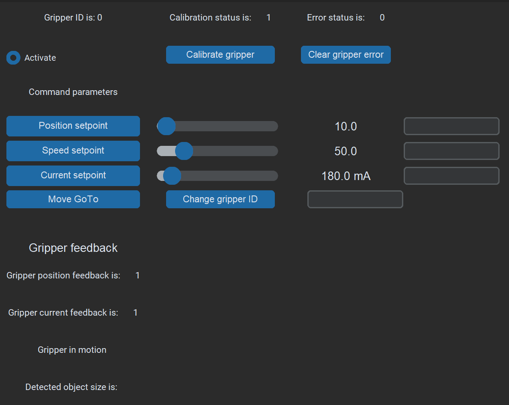

# PAROL commander GUI 

When you start PAROL6 commander software you will be met with 2 windows: 

* Commander window
* Simulator window

  

        Fig - commander window

  

        Fig - simulator window

Commander window is used to Jog robot, read logs, write programs, home the robot... 
Simulator window is used to show your robot in real time.

!!! Note annotate "Note"

    Simulator only works if your robot is connected!

  

        Fig - Connect bar

At the bottom of commander software window you will see an entry bar and connect button. 

In the field next to the Connect button enter your serial com port.
* Windows: enter COMx (x represents your com port number)
* Linux: enter ttyACMx (x represents your com port number)

Clear error has same function as enable button.

Sim and real robot buttons have no function at the moment.

  

        Fig - cartesian jog

Cartesian jog is used to move robot in cartesian space. You can use  TRF frame or WRF frame. TRF is represented by axes on your end effctor while WRF is represented by axes on the robot base. 

!!! Note annotate "Note"

    When jogging in cartesian mode you WILL hit singularities. Go to general concepts tab on this webpage and read more about them! 

  

        Fig - joint jog

Joint jog is used to jog indivitial motors. LEFT IS POSITIVE DIRECTION RIGHT IS NEGATIVE DIRECTION!

  

        Fig - program window

This window allows you to write robot scripts. Check the software tab to learn more about it!

  

        Fig - start stop tab

You can start the execution of your programs by pressing start. By pressing stop the program will stop. 

  

        Fig - commands window

This window allows you to just select commands you want to use and click on them. They will appear in the program window. If using current positon/pose movement commands (MoveJoint, MovePose, SpeedJoint, MoveCart,MoveCartRelTRF, SpeedCart...) they will add current pose or joint position as arguments. Custom positon/pose will not add any values.

  

        Fig - Response log
    
In the response log you will see error logs and active commands.

  

        Fig - robot position

Here you can see the position of the robot joints and the position of end-effector in cartesian space. You can change the joint and cartesian space velocity with the slider. Home button will start homing your robot. Enable button will clear all errors and enable robot for operation. Disable will disable robot.

All we talked about was located in Move menu. All other menus will stay the same only the JOG MENUS will be replaced with another window! 

  

        Fig - IO tab

Here you can check the state of your inputs and set the desired state to your outputs

  

        Fig - Settings tab

Here you can change GUI from dark to light mode and change the scaling to fit

  

        Fig - Gripper tab

Here you control and configure your gripper. After homing the robot press calibrate gripper button.  
Gripper will start to move and its status will change to calibrated. Press "clear gripper error".  
Now you can command gripper to go to the specific position with specific speed and torque.  

Set the setpoints with the sliders and press "Move GoTo" 
Under gripper feedback you will see gripper current and position feedback. 
You will also see what is status of the gripper. If it is in motion, detected object...

