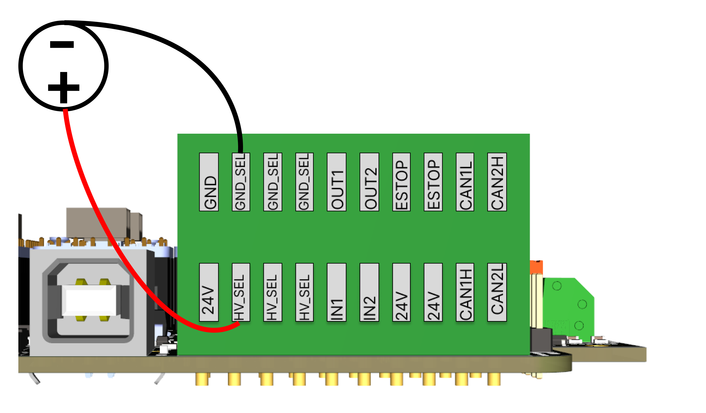
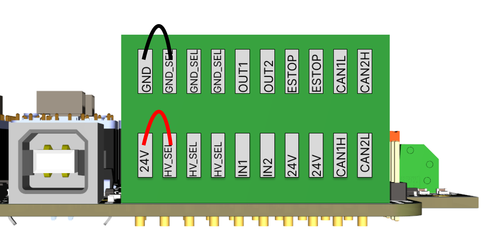

# Peripherals

PAROL6 control board has multiple ways to interact with outside world. Communication with high level code running on a PC is done with USB, but on top of that you can use other features like I/O or CAN to communicata.

## I/O connections

PAROL6 is equipped with 2 isolated inputs and 2 isolated outputs.

### Isolated power supply

It is standard to have isolated Inputs and Outputs to protect your device. 
To use isolated power supply follow the connections on image below. Connect minus of power supply  
to any of **GND_SEL** pins and plus of power supply to any of **HV_SEL** pins.

!!! Note annotate "Note!"

    **Even tho Inputs and Outputs are now isolated from the robot, the ESTOP is still connected to the same power supply of the robot**

By using isolated power supply you are not limited to 24V. You can use 5V or 12V depending on your aplications.

### Not isolated power supply

By following the connections as shown on image below all inputs and outputs will be connected to power supply of the robot.

### Examples of input connections

Inputs can be limit switches, push buttons, Sensors...
For limit switch connect one end of the switch to HV_SEL and another one to IN1 or IN2.

### Examples of output connections

Outputs can be releys, lamps, low power actuators...
For releys connect one end to GND_SEL and another to OUT1 or OUT2.

## CAN bus

!!! Tip annotate "Still under developement"

Can bus will allow you to connect external grippers and additional axes.  
There are 2 CAN buses.

## Pneumatics

!!! Note annotate "Recommended pressure"

    Recommended pressure for PAROL6 and generally in industry is 6-8 bar. All examples conducted with pneumatics you see in our videos are done with pressures in that range.

### Example of gripper connection

The 2 tubes going into a gripper are tubes that exit the PAROL6 robotic arm at a forearm region. Tubes going from the pneumatic valve need to be connected to the pneumatic connections in the base of the robot. Orientation is imporatant. Switching the 2 tubes will make your gripper normally closed or normally open depending on the orientation.

## Estop

Connection is as follows:

**Estop needs to be connected for normal operation of the robot**

!!! Note annotate "TIP"

    If you dont have an ESTOP you can use any NO switch!

!!! Note annotate "TIP2"

    On PAROL6 controller board there are connectors for 2 ESTOPS. They both share same GPIO on microcontroller.
    They both need to be NO contact. 

Estop needs to be NORMALLY CLOSED (NO) contact type. NC will not work. 
NO is beneficial in case your estop unplugs or gets its wires cut it will also register as a press of an estop, which is desirable behaviour.

