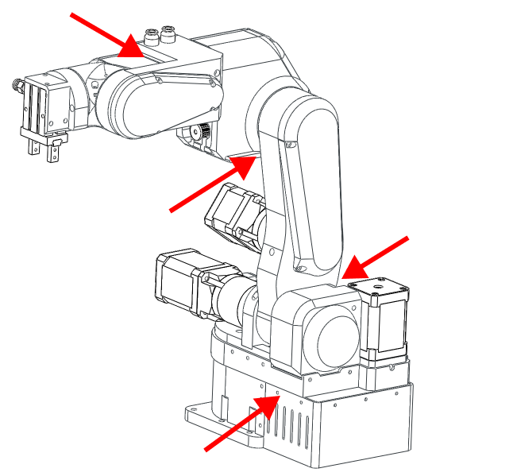
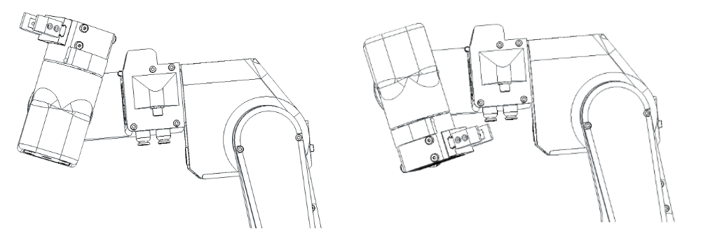

# Safety and handling

!!! Warning annotate "Warning"

    Not following the procedures can cause damage to the robot and operator. 
    Make sure you read them and FOLLOW THEM!

PAROL6 needs special handling even tho it is lightweight desktop robot. Weighting only 5kg it still needs to be anhored to the surfaces.
In case of power loss the robots joints will not hold themselfs and robot will start to fall down. That is the property of the relativly low reduction ratios in PAROL6. 

!!! info annotate "Addition of brakes"

    Solution for that problem, like in industrial aplications is to use brakes. Addition of brakes is on TODO list for PAROL6.

PAROL6 requires 3 connections for normal operation.

* Power connection -> Marked green on image

* USB connection -> Marked blue on image

* ESTOP -> Marked with yellow and pink squares (One lead of ESTOP to pink one to yellow)

## Code upload

When uploading code to the PAROL6 controller board TURN OFF the 24V power supply of the robot. When uploading code to PAROL6 controller board it receives 3v3 from stlink device. This keeps the robot constantly ON and blocks the shutdown of the robot with a powerbutton located on the base.  
After the code is uploaded disconnect the stlink, turn on the robot with power button located on the base and then run the PAROL6 commander software.

## USB 

USB connection does not power the board!

## Safe shutdown

!!! Danger annotate "Do not try to power off the robot when it is running!"

    If robot start to behave unexpectedly USE ESTOP. 
    If ESTOP is not functional power of the power supply. 
    Reaching for the power button should be the last option.

Because lack of brakes sudden loss of power will result in robot falling down. That may cause damage to the robot or the operator.
Robot is powered on and off by pressing a button marked red on the image. When powering the robot on even when USB connection is not available it will energise the
the motors. It will produce 6 clicking sounds and that is normal behaviour. 

Powering off the robot is also done by pressing button marked in RED. Before you power off the robot **GRAB IT BY THE FOREARM** and then press the button. This will ensure that robot does not fall down.

## Anchoring the robot

!!! Danger annotate "Robot that is not anchored WILL fall over!"

There are 2 ways of anchoring the robot:

* Using the 6 holes in the base of the robot to attach it to the surface
* Using clamps to attach it to the edge of the table or work surface

## Pinching points

Be careful when the robot is running. There are few pinching points that can hurt you and others.  
Also make sure that additional wires or tubes are not in the pinching points!

##  Joint limits

!!! Warning annotate "Warning"

    Never spin joint 5 more then one rotation

The image above represents the range of J5.

## Transport

When moving the robot it is best to move joints 2 and 3 to the limit switches. After that grab the robot by the base and you can carry it around.

When packing the robot it is recommended to put some kind of sponge or styrofoam under J3 limit switch. After that you can tape around forearm and upper arm links.

## ESTOP

**Estop needs to be connected for normal operation of the robot**

!!! Note annotate "TIP"

    If you dont have an ESTOP you can use any NO switch!

!!! Note annotate "TIP2"

    On PAROL6 controller board there are connectors for 2 ESTOPS. They both share same GPIO on microcontroller.
    They both need to be NO contact. 

Estop needs to be NORMALLY CLOSED (NO) contact type. NC will not work. 
NO is beneficial in case your estop unplugs or gets its wires cut it will also register as a press of an estop, which is desirable behaviour.

